# Authenticated vs. Unauthenticated Scan (Windows)

# Project Scope

In the previous project, I introduced the three primary vulnerability scanning methods available in Tenable—authenticated, unauthenticated, and agent-based scans—and explained the purpose of each approach. In this project, the focus shifts from theory to a practical comparison between **authenticated** and **unauthenticated** vulnerability scans.

Using the same intentionally vulnerable Windows virtual machine deployed within a live Microsoft Azure training environment, I will configure and execute both scan types against the same target. By comparing the results side by side, we can clearly see how the use of valid system credentials impacts the depth and accuracy of a vulnerability assessment.

Throughout this walkthrough, I will explain the configuration of each scan, demonstrate the differences in their findings, and discuss why organizations use both scanning methods as part of a comprehensive vulnerability management program. By the end of this project, you will understand the advantages, limitations, and real-world use cases of authenticated and unauthenticated scanning, providing a solid foundation for the final project in this series on agent-based vulnerability scanning.

---

# Virtual Machine Configuration 
To begin this comparison, I will create a Windows 11 Pro virtual machine in Microsoft Azure. This machine will serve as the target for both the authenticated and unauthenticated vulnerability scans, ensuring that each scan evaluates the exact same environment.

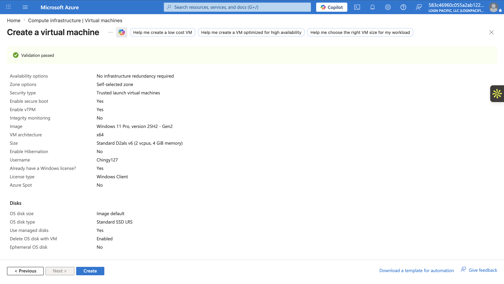

After deploying the virtual machine, I will intentionally introduce a security weakness by disabling the Windows Defender Firewall. This allows the scans to communicate with the machine without network restrictions and helps demonstrate how each scanning method behaves in a controlled, intentionally vulnerable environment.

To access the virtual machine securely, I will connect using **Azure Bastion** with the credentials assigned during deployment.

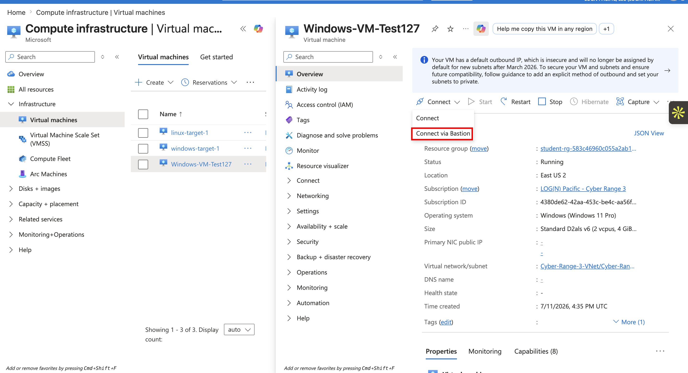

Once connected, I will open the **Run** dialog (`Win + R`) and enter the following command:

```
wf.msc
```

This command opens the **Windows Defender Firewall with Advanced Security** console.

From here, I will select **Windows Defender Firewall Properties** and disable the firewall for all three network profiles:

- Domain Profile
- Private Profile
- Public Profile

Once these settings are applied, the Windows Defender Firewall will be disabled across the entire virtual machine.

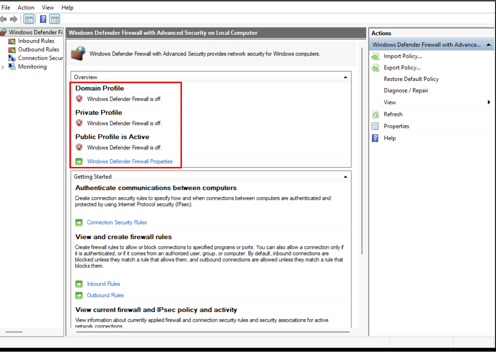

### Why Disable the Firewall?

In a production environment, disabling a firewall would be considered a serious security risk. Firewalls are designed to restrict unauthorized network traffic and serve as one of the first layers of defense against attackers.

Without a firewall, malicious users can more easily:

- Discover open ports
- Enumerate network services
- Perform vulnerability scans
- Attempt unauthorized access to exposed services

Instead of disabling the firewall completely, security administrators typically create **specific inbound or outbound rules** that allow only the traffic required for legitimate business operations.

For vulnerability scanning, a common practice is to allow traffic only from the vulnerability scanner itself while blocking all other unsolicited connections.

To demonstrate this approach, I will create a **Network Security Group (NSG)** within Microsoft Azure and configure inbound rules that control which systems are permitted to communicate with the virtual machine.

## Creating a Network Security Group

The first step is creating the Network Security Group.

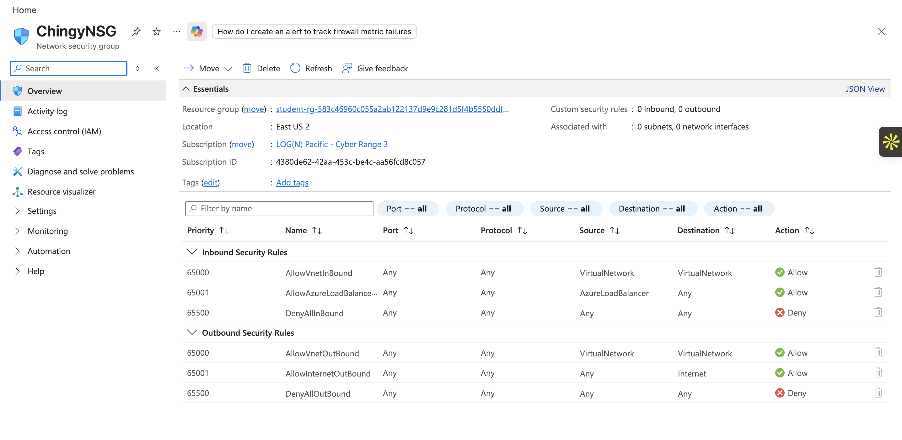

Next, I will associate the Network Security Group with the virtual machine. This ensures that any security rules configured within the NSG are applied specifically to this VM.

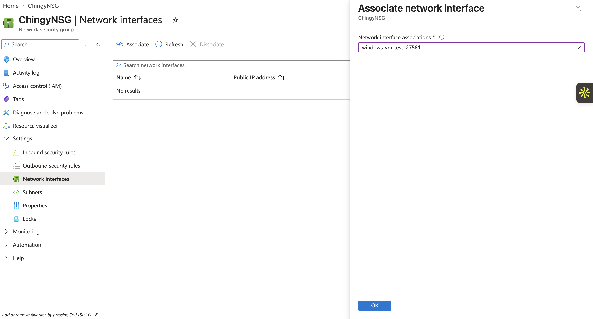

## Creating a Secure Inbound Rule

A secure configuration would allow traffic only from the Nessus scanner.

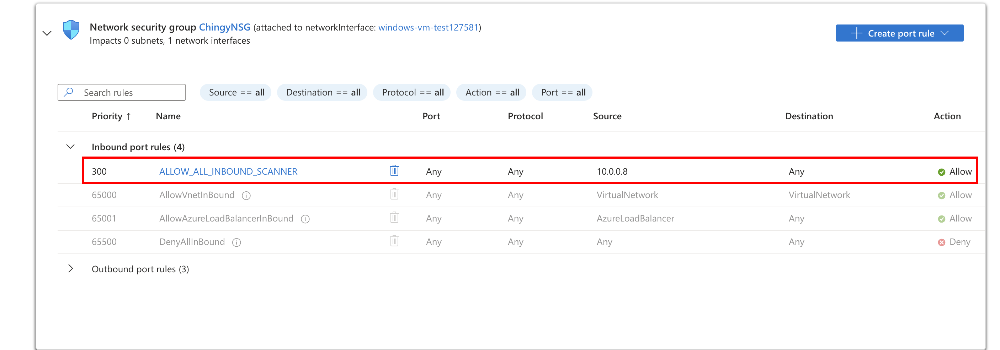

In this example, only the IP address **10.0.0.8** (the Nessus scanning machine) is permitted to communicate with the virtual machine. This follows the principle of least privilege by granting only the minimum access necessary to perform the vulnerability assessment.

## Creating an Intentionally Vulnerable Rule

Since the purpose of this lab is to compare scan types within an intentionally vulnerable environment, I will replace the restrictive rule with one that allows traffic from any source.

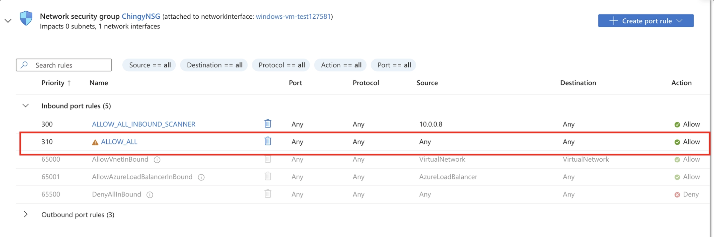

Allowing unrestricted inbound traffic is **not recommended in production environments**, but it creates an ideal scenario for demonstrating how authenticated and unauthenticated scans detect vulnerabilities under identical conditions.

With the environment fully configured, we can now compare the results of an **Unauthenticated Scan** and an **Authenticated Scan**.

---

# Unauthenticated Scan

To begin, I will create a **Basic Network Scan** in Tenable Nessus.

The required configuration includes:

- Selecting the scan engine
- Entering the target virtual machine's private IP address
- Choosing the scan template

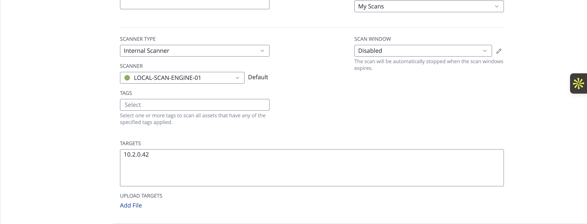

Next, I will customize two discovery settings before launching the scan.

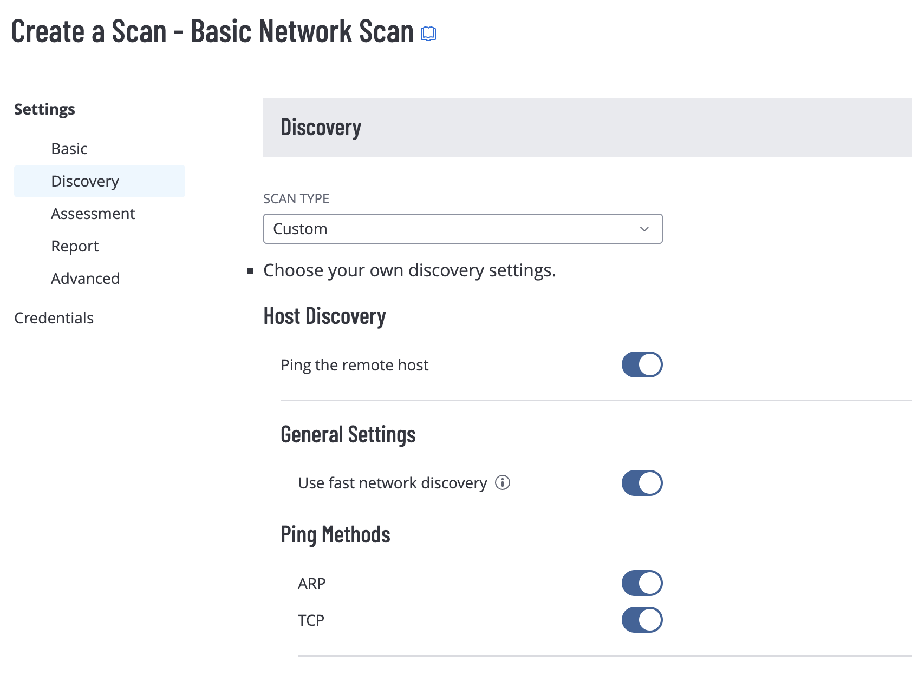

### Ping the Remote Host

This option instructs Nessus to determine whether the target system is online before performing the vulnerability assessment. If the host does not respond, Nessus avoids wasting time scanning an unavailable device.

### Use Fast Network Discovery

Fast Network Discovery reduces the number of verification checks performed during host discovery, significantly decreasing scan time. The tradeoff is that the scan may produce additional false positives because fewer validation steps are performed.

Since this is an **unauthenticated scan**, no credentials will be provided. Nessus will evaluate the target strictly from the perspective of an external system with no authorized access.

Once the configuration is complete, I will launch the scan.

> **Note:** Depending on the size and complexity of the target environment, scans may take several minutes to complete.
> 

After the scan finishes, I can review the results.

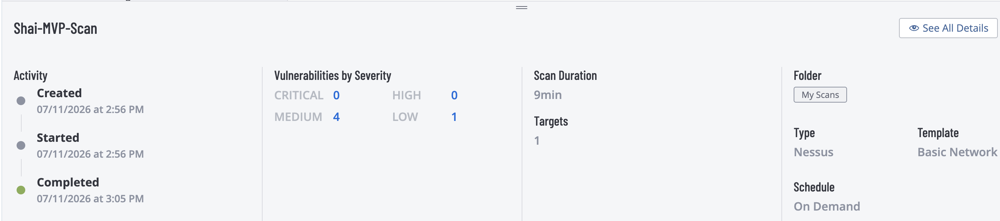

The unauthenticated scan completed in approximately **9 minutes** and identified:

- 4 Medium vulnerabilities
- 1 Low vulnerability

Selecting the completed scan provides a more detailed breakdown of the findings.

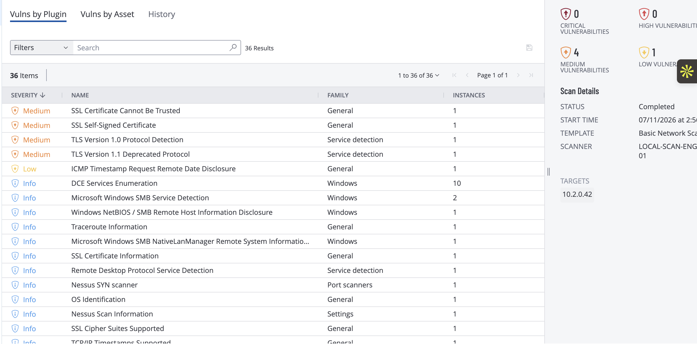

The vulnerability list is organized by severity, allowing security analysts to prioritize remediation efforts based on risk.

Selecting an individual finding opens a detailed report containing:

- Vulnerability description
- Risk level
- CVSS score
- Affected services
- Remediation recommendations

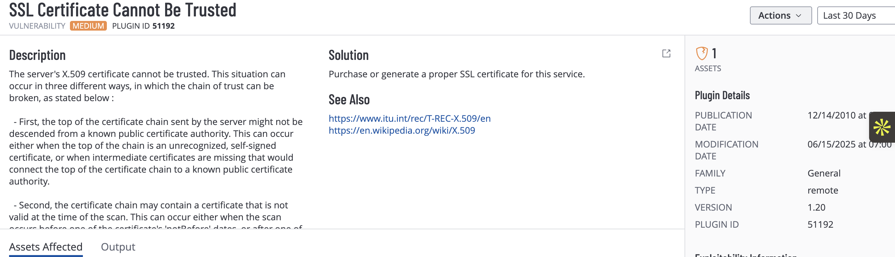

One important observation is that the unauthenticated scan **did not detect several internal vulnerabilities** that exist on the virtual machine.

This is expected because, without valid credentials, Nessus is limited to examining only what is exposed over the network. It can identify open ports, running services, and externally visible software versions, but it cannot inspect operating system configurations, installed patches, registry settings, or other internal components.

---

# Authenticated Scan

Next, I will perform an authenticated scan against the same virtual machine.

Unlike the previous scan, this assessment includes valid Windows credentials, allowing Nessus to securely authenticate to the operating system and perform a much deeper inspection of the target.

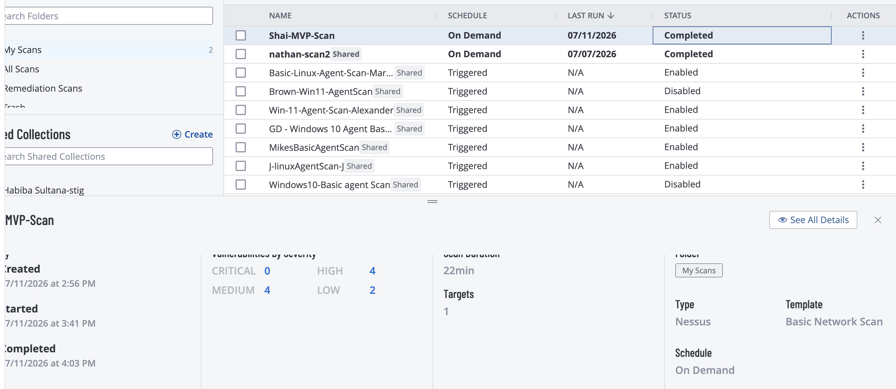

Because Nessus now has administrative visibility into the system, it can evaluate areas that were previously inaccessible, including:

- Missing Windows security updates
- Installed software versions
- Registry configurations
- Local security policies
- Additional operating system settings

Although the authenticated scan required approximately **22 minutes** to complete—more than twice the duration of the unauthenticated scan—it identified substantially more vulnerabilities:

- 4 High vulnerabilities
- 4 Medium vulnerabilities
- 2 Low vulnerabilities

The increase in scan time reflects the additional inspection performed after successfully authenticating to the operating system. Rather than evaluating only externally visible services, Nessus was able to examine the internal configuration of the virtual machine, resulting in a far more comprehensive assessment.

The comparison between these two scans demonstrates why authenticated vulnerability scanning is considered the industry standard for internal vulnerability management. While unauthenticated scans are valuable for identifying externally exposed weaknesses, authenticated scans provide significantly deeper visibility into a system's overall security posture.
