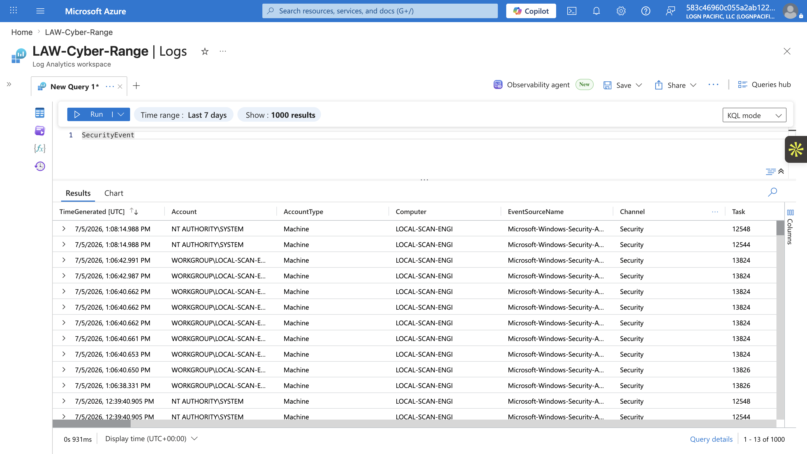
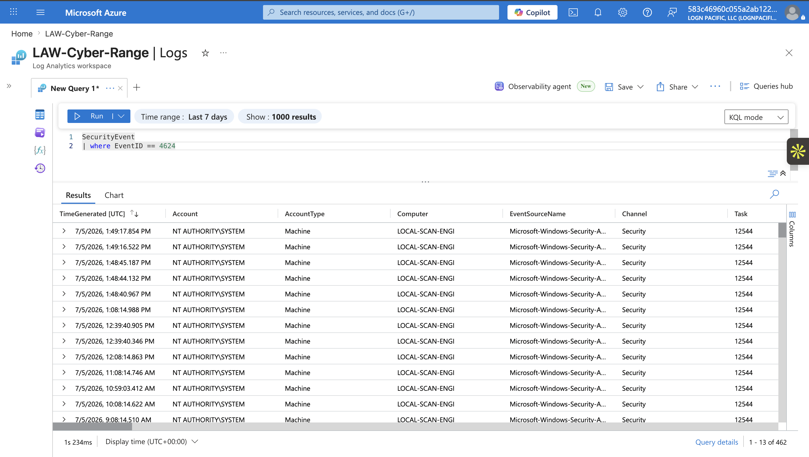
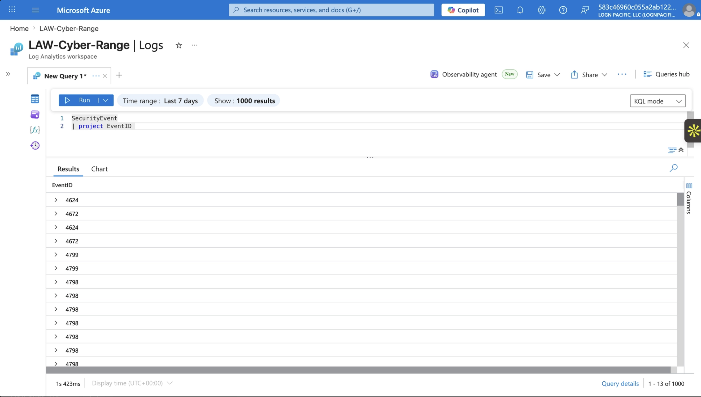
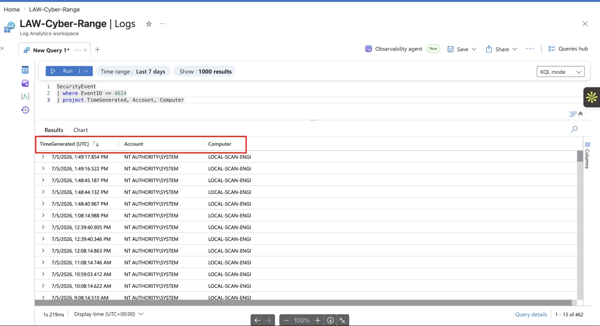

# Project Overview

This project introduces the basics of working with Azure logs and writing simple Kusto Query Language (KQL) queries. The goal is to understand how Azure collects log data, how that data is structured, and how KQL is used to search and filter through it.

The environment used in this project is a live, community-based Azure lab where users deploy and interact with virtual machines. These actions generate real log data inside Azure, including events such as virtual machine creation, sign-ins, network activity, and system changes. This provides a realistic dataset to practice querying and analyzing cloud activity. I will be using this same platform throughout the rest of my projects, but if I were to change platforms, I would let you know in the future.

Throughout this room, I will explain the fundamentals of KQL and demonstrate simple commands to explore log data. These examples will serve as the foundation for more advanced queries and investigations in later projects.

---

# What is KQL?

**Kusto Query Language (KQL)** is a query language used to search, analyze, and explore large amounts of data stored in Azure services such as Azure Monitor, Log Analytics, and Microsoft Sentinel. It is designed specifically for working with log and telemetry data, making it a core tool for cloud monitoring and security investigations.

KQL works by running queries against tables of data, where each table contains structured logs (for example, sign-in events, virtual machine activity, or network traffic). Instead of manually searching through raw logs, KQL allows you to filter, sort, and summarize data using readable commands like `where` and `project`. This makes it much easier to quickly find relevant events in large datasets.

KQL is important because modern cloud environments generate massive amounts of log data every second, which would be impossible to analyze manually. Security analysts, cloud engineers, and SOC teams rely on KQL to investigate incidents, detect suspicious activity, and monitor system health. It is especially valuable in tools like Microsoft Sentinel, where fast and accurate log analysis is essential for identifying threats and responding to security events.

---

# Simple KQL commands

I want to provide a visual demonstration of KQL in use within this live Azure environment, so I will be using simple commands and telling you what they do and what they are used for.

To start, let's use `SecurityEvent`

```kusto
SecurityEvent
```


This may look intimidating, but this is actually very simple. What this command does is return all records from the `SecurityEvent` table. It’s the simplest way to see what kind of data exists in a log source before applying any filters.

This data represents security-related activity happening on virtual machines, such as users logging in, permissions being assigned, and changes to account or group access. Each row is a single event that was recorded by Windows and forwarded into Azure.

The important thing to notice is that these logs are structured and event-driven, meaning each entry has an Event ID (like 4624 or 4672) that represents a specific type of action. For example, successful logins, privilege assignments, or group changes are all tracked automatically. Instead of reading raw system logs on each machine, KQL allows you to query and filter this centralized dataset to quickly understand what is happening across all systems.

Here is an example of filtering:

```kusto
SecurityEvent
| where EventID == 4624
```


This query filters the `SecurityEvent` table to only show events where `EventID` is `4624`, which represents a **successful user logon**.

Instead of seeing all security activity, you’re narrowing the data down to just login events. This is useful when you want to focus on authentication activity and ignore everything else.

In a case where you only want to see all of the EventIDs, you can use this can use the `project` command:

```kusto
SecurityEvent
| project EventID 
```



However, in our case, we want to see what the EventID of 4624 is logging in particular

Within the table we used, `SecurityEvent` , there were columns I saw in particular that I only want to see, which were `TimeGenerated, Account, Computer` 

So now, to make everything more readable, let's combine the `project` command and the `where` command into one query:

```kusto
SecurityEvent
| where EventID == 4624
| project TimeGenerated, Account, Computer
```



What we did here was use the `where` command to filter for the EventID of specifically `4624` and we used `project` to only show the column information of the time when the event happened, the user that was involved in the event, and the machine the event came from (since this is a cloud environment, the Virtual Machine name)

In this particular case, an admin is using the environment's local scan engine to get more details about vulnerabilities on each machine that is created. I will go into more details in later projects where I use a scanning platform named Tenable.

# Conclusion

That’s the basics covered for now. We looked at what Azure security logs actually are, explored the `SecurityEvent` table, and ran a few simple KQL queries to start making sense of the data. From there, we filtered results, trimmed down columns to the most useful fields, and broke down key values like `TimeGenerated`, `Account`, and Computer actually represent in real investigations.

We didn't go over much because this is just the foundation. In the next part, I’ll start building on these basics with more practical queries that I actually use, and we’ll move into digging deeper into logs and connecting events to understand what’s really happening. If you wanted to learn more, you can use this resource: https://learn.microsoft.com/en-us/defender-xdr/incidents-overview

