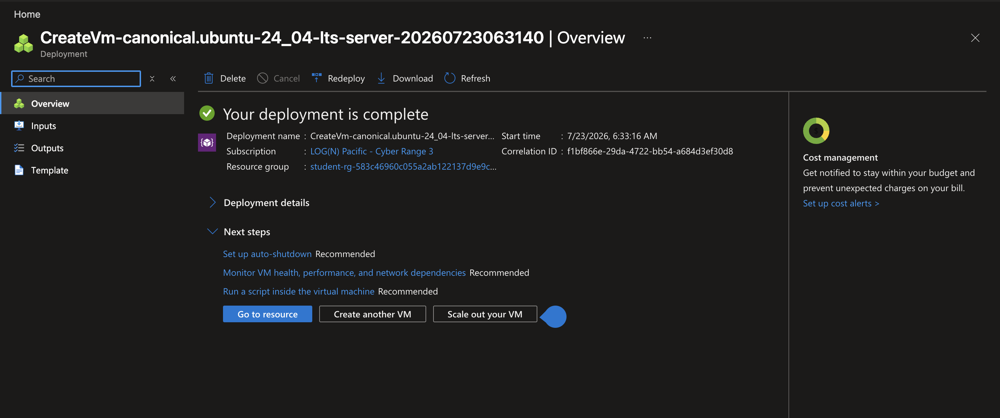
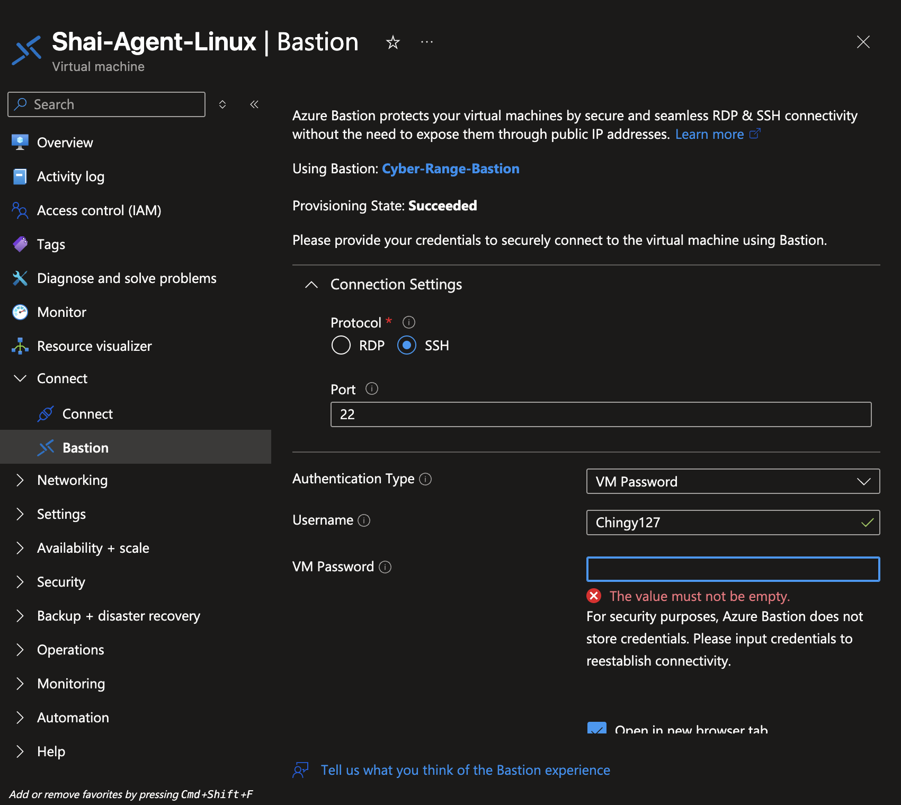
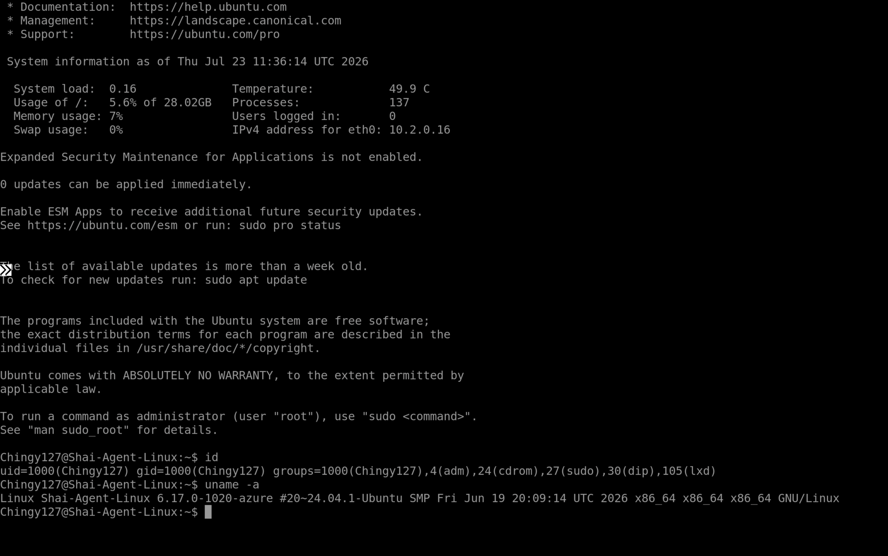
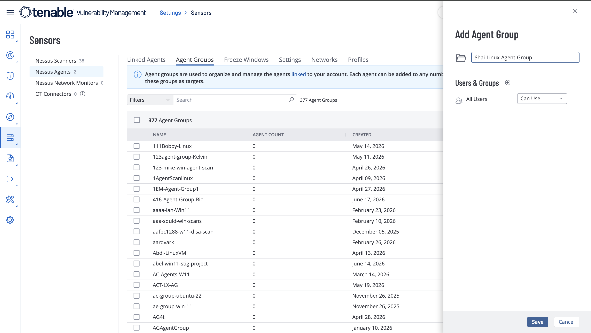
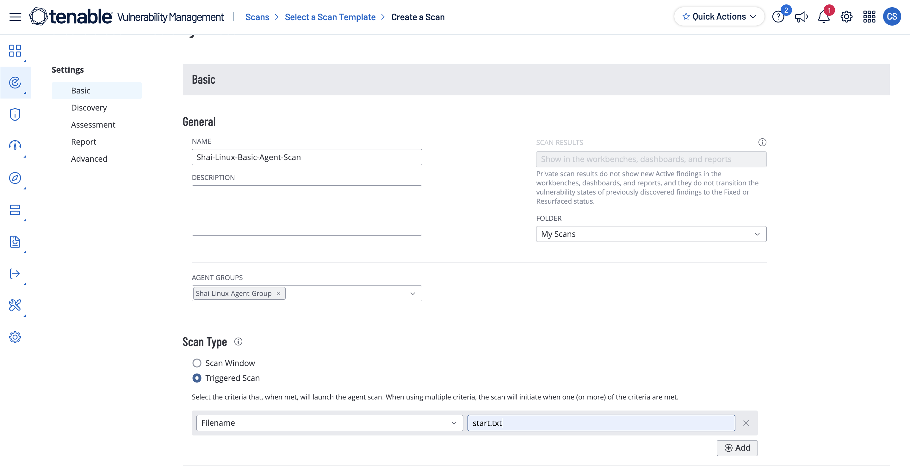
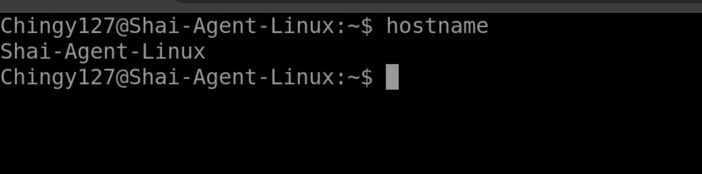
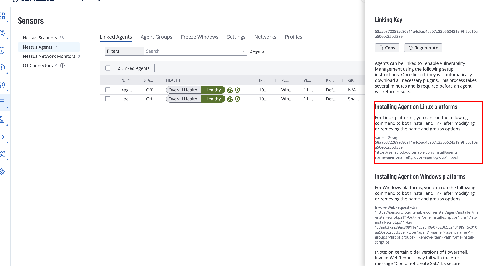
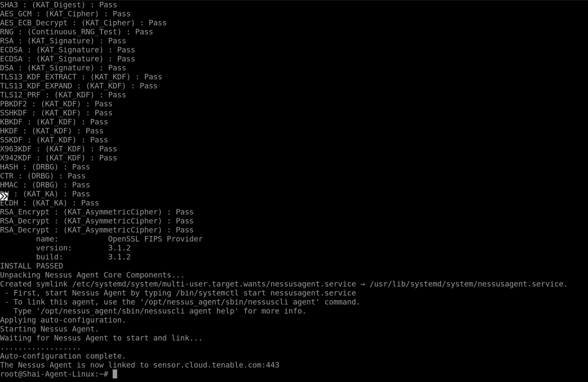
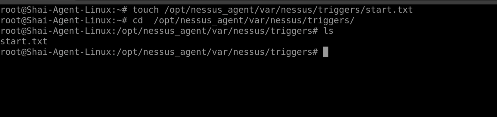
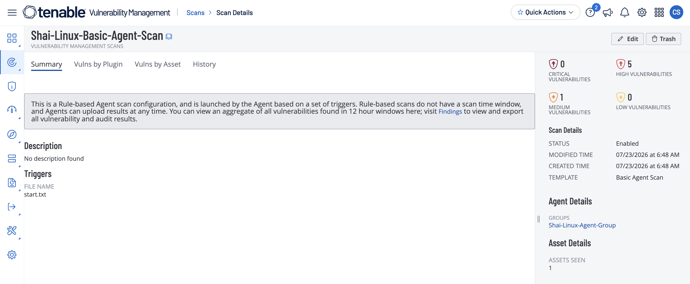

# Agent-Based Monitoring: Linux

# Project Overview

In the previous project, I demonstrated how to perform an **agent-based vulnerability assessment** against a Windows virtual machine using the **Tenable Nessus Agent**. In this project, I will apply the same approach to an **Ubuntu Server** virtual machine to demonstrate how agent-based scanning is performed on Linux systems.

Like its Windows counterpart, the **Tenable Nessus Agent** is installed directly on the Linux endpoint, allowing the system to perform vulnerability assessments locally and securely transmit the results to the Tenable platform. Because the assessment is executed from within the operating system, organizations can continuously monitor Linux devices regardless of network location, firewall restrictions, VPN connectivity, or whether the endpoint is connected to the corporate network.

Using an Ubuntu Server virtual machine hosted in Microsoft Azure, I will demonstrate how to deploy and register a Nessus Agent, assign it to an Agent Group, configure a trigger-based scan, and review the resulting vulnerability findings. This project illustrates how agent-based scanning provides organizations with consistent visibility into the security posture of Linux systems while simplifying endpoint vulnerability management across distributed environments.

---

# VM Creation

I will create the same exact vulnerable/outdated machine as I did for the **Authenticated vs. Unauthenticated** project for the Linux system



Now, I will confirm its creation by using the manually configured credentials assigned to the machine by using **Bastion**



I have logged in, so the VM is confirmed to be up and running:



I ran the command:

```bash
id
```

to confirm that I am the only one within the machine I created 

I also ran the command:

```bash
uname -a 
```

To confirm that the version of the machine is accurate to the one that I chose during the creation of the VM

---

# Creating Agent Group & Agent Scan

Now that the Ubuntu Server virtual machine has been deployed, I will configure the Tenable environment by creating both an **Agent Group** and an **Agent Scan**.

The Agent Group serves as a logical container for organizing and managing one or more Nessus Agents. Instead of targeting individual endpoints, scans and policies are assigned to the Agent Group, making it easier to manage large numbers of systems within an enterprise environment.

Here, I am creating an Agent Group named **`Shai-Linux-Agent-Group`**. Once the group has been created, it will be used as the target for the agent-based vulnerability scan.



After saving the Agent Group, I will create a new **Agent Scan** and associate it with the newly created group.

Within the **Basic** tab, I configured the following settings:

- **Scan Name:** Shai Linux Agent Scan
- **Target:** Shai-Linux-Agent-Group
- **Scan Type:** Triggered Scan

A **Triggered Scan** allows the Nessus Agent to begin a vulnerability assessment only after detecting a predefined trigger. Rather than relying on scheduled scans or manual execution from the Tenable console, the agent continuously monitors for the trigger condition and automatically starts the scan when it is met.



---

# Downloading the Agent

Before the endpoint can participate in an agent-based assessment, the **Tenable Nessus Agent** must be installed and registered with the Tenable Vulnerability Management platform.

To accomplish this, Tenable provides a pre-generated installation command that contains the organization's linking key along with the Agent Group assignment. During installation, the agent securely registers itself with the Tenable platform and automatically joins the specified Agent Group, allowing it to receive scan instructions and report vulnerability data.

The following command downloads the installation package directly from Tenable's cloud infrastructure and immediately executes the installation process.

```bash
curl -H 'X-Key: 58aab372289ac80911e4c5ad40a07b23b5524319f9ff5c010aa50ec625ccf389' 'https://sensor.cloud.tenable.com/install/agent?Shai-Agent-Linux&groups=Shai-Linux-Agent-Group' | bash
```

> **Note:** The linking key shown in this demonstration is specific to the isolated lab environment and is generated by Tenable for agent registration. Production environments should protect these keys and rotate them according to organizational security policies.
> 

The installation command is generated directly from the Tenable console, ensuring that the agent automatically registers with the correct Vulnerability Management instance and joins the intended Agent Group.



Here is where I got the command to install the Agent



Before running the installation command, I will switch to the **root** account using the following command:

```bash
sudo -i
```

Installing software and registering the Nessus Agent requires administrative privileges. Switching to the root user ensures the installation has sufficient permissions to create directories, install services, and communicate with the Tenable platform.

After obtaining administrative privileges, I will execute the installation command.



Once installation completes successfully, the Nessus Agent begins communicating with the Tenable platform and waits for a scan trigger.

To initiate the scan, I will create the trigger file that was configured earlier.

```bash
touch /opt/nessus_agent/var/nessus/triggers/start.txt
```

The `touch` command creates an empty file named **`start.txt`** within the Nessus Agent trigger directory. The agent continuously monitors this directory, and once it detects the trigger file, it automatically deletes the file and begins the vulnerability assessment.



After several minutes, the trigger file is removed, indicating that the Nessus Agent has successfully started the scan.

Once the assessment finishes, I can review the results within the Tenable console.



The vulnerability assessment identified:

- **5 High** severity findings
- **1 Medium** severity finding

---

# Conclusion

This project demonstrated how to deploy and utilize the **Tenable Nessus Agent** to perform an agent-based vulnerability assessment against an Ubuntu Server virtual machine. By installing the agent directly on the endpoint, registering it with the Tenable platform, organizing it within an Agent Group, and configuring a trigger-based scan, the assessment was performed locally without relying on a traditional network-based scanner.

Unlike conventional remote vulnerability scans, agent-based scanning provides organizations with continuous visibility into Linux endpoints regardless of network connectivity, firewall restrictions, or physical location. This approach is especially valuable for servers, cloud workloads, and remote devices that may not always be accessible from an internal scanning engine.

The findings identified during the assessment demonstrate how agent-based scanning can effectively detect vulnerabilities while simplifying vulnerability management across distributed environments. As organizations continue to adopt cloud infrastructure and remote endpoints, deploying lightweight agents has become an increasingly important strategy for maintaining comprehensive visibility into the security posture of Linux systems.
