# Agent-Based Monitoring: Windows

# Project Overview

In the previous projects, I demonstrated how authenticated and unauthenticated vulnerability scans differ when assessing both Windows and Linux systems. In this project, I will perform an **agent-based vulnerability assessment** against a Windows virtual machine using the **Tenable Nessus Agent**.

Unlike traditional network-based vulnerability scans that assess systems remotely, an **agent-based scan** installs a lightweight Nessus Agent directly on the endpoint. The agent performs vulnerability assessments locally and securely reports the results back to the Tenable platform. This approach enables organizations to continuously assess systems regardless of network location, firewall restrictions, VPN connectivity, or whether the device is actively connected to the corporate network.

Using a Windows virtual machine hosted in Microsoft Azure, I will demonstrate how to deploy a Nessus Agent, organize it within an Agent Group, configure a trigger-based scan, and review the resulting vulnerability findings. This project highlights why agent-based scanning has become an essential component of modern vulnerability management by providing consistent visibility into endpoint security while reducing the reliance on traditional credentialed network scans.

---

# VM Creation

First, the Windows VM (Virtual Machine) must be created. I will do this by using the Azure platform

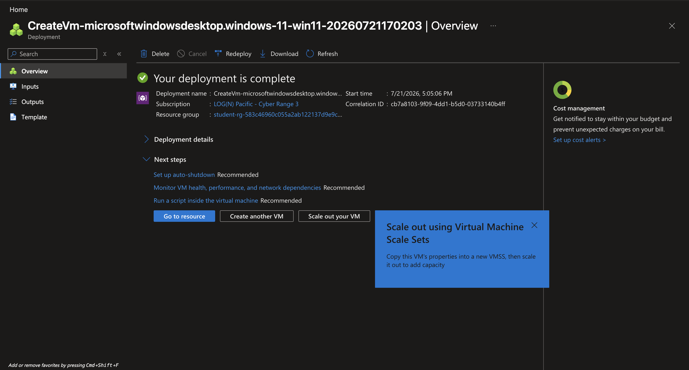

---

# Agent Group Creation

Now, I will create an **Agent Group** within tenable 

A Tenable **Agent Group** is **a logical container used to organize and manage Nessus Agents across your network**. Instead of configuring scans or deploying policies to individual agents, administrators bundle agents into these groups. You cannot launch a scan against an isolated agent; you must target an Agent Group

**Why Agent Groups are Valuable for a DISA STIG Scan**Running a **DISA STIG** scan usually requires deep, credentialed compliance auditing to verify that strict Department of Defense (DoD) baselines are met. Agent groups bring significant value to this process through the following mechanisms:

- Bypasses Firewall & Remote Access Restrictions
- Eliminates Credential Fatigue
- Streamlines Compliance Targeting
- Reduces Network Overhead and Performance Impact

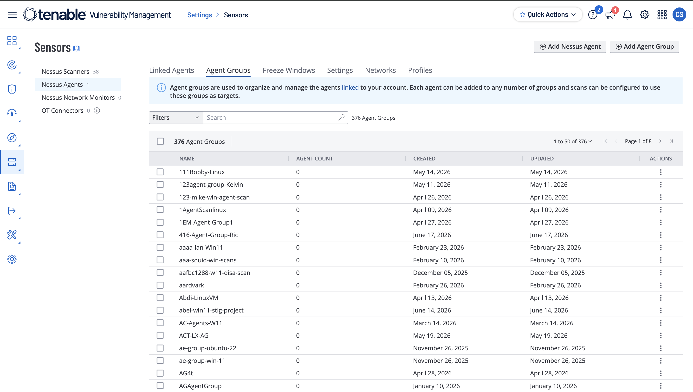

Here are all of the existing **Agent Groups** within this live environment

After creating my agent group by clicking “Add Agent Group” and assigning the group a name, I can filter it out by typing in the group name in the search bar

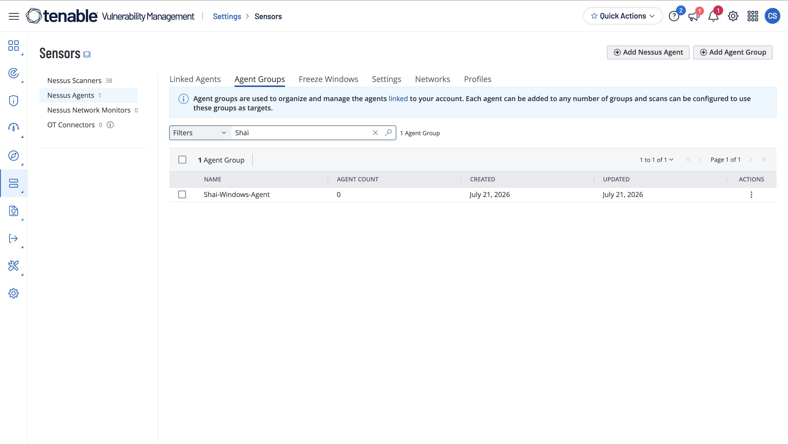

Now, I will create a **Basic Agent Scan**, then assign that scan to the **Agent Group** that I have created 

I will also configure the following settings in the **Basic** tab

- Scan Type: Triggered Scan
    - An automated agent scan that launches without central scheduling or user intervention. It activates only when specific conditions are met, such as reaching a set time interval or detecting a designated trigger file placed on the endpoint
    
    I will be creating a file-name trigger so that when that file appears, the agent will trigger the scan (the file-name is **start.txt**
    
    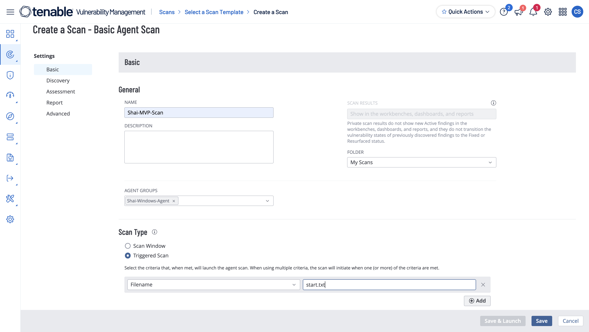
    

---

# Prepartation

Now, I will use a built-in feature named Bastion in Azure to log in to the virtual machine I have created and from there I will open up the notepad

From there, I will paste this command within the:

```bash
Invoke-WebRequest -Uri "https://sensor.cloud.tenable.com/install/agent/installer/ms-install-script.ps1" -OutFile "./ms-install-script.ps1"; & "./ms-install-script.ps1" -key "58aab372289ac80911e4c5ad40a07b23b5524319f9ff5c010aa50ec625ccf389" -type "agent" -groups 'Shai-Windows-Agent'; Remove-Item -Path "./ms-install-script.ps1"
```

This downloads a script from Tenable’s web server and puts it on the workstation given, and it will then execute the PowerShell script given after the key is verified. It then associates everything with the agent I created earlier

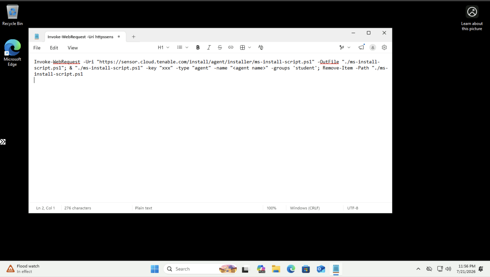

I got this command from Tenable 

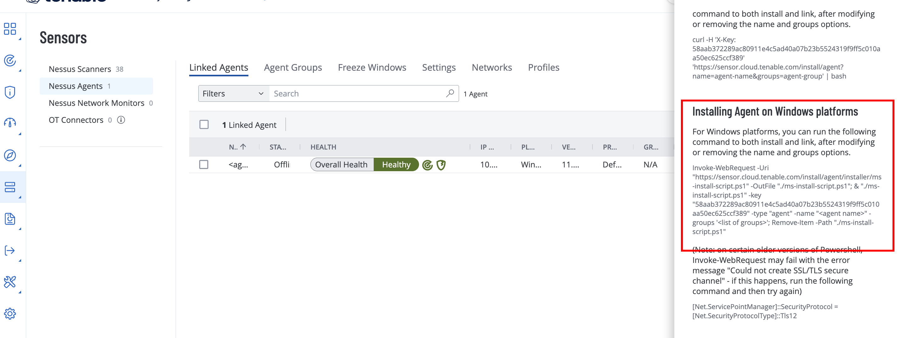

I put this in Notepad so I could modify and copy the command within the VM

Now I will paste this in PowerShell after starting it as an admin 

After running the command, it will start going over the process stated earlier

After it is done, it will look like this:

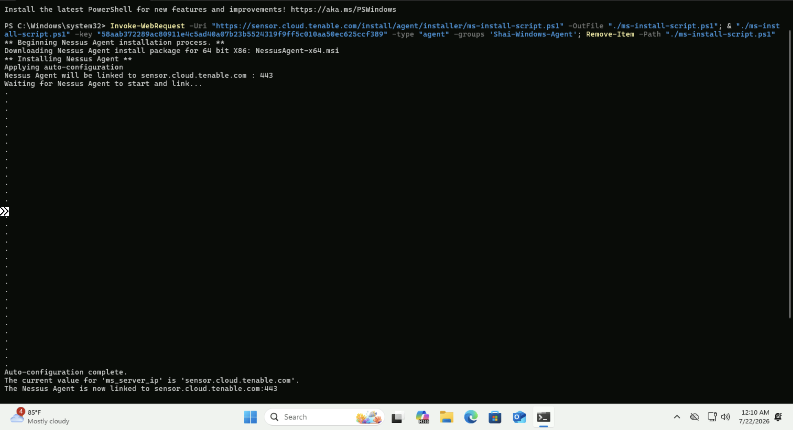

---

# Triggering the Scan

To initiate the scan, I must create a file named **`start.txt`**, which was configured earlier as the **trigger file** for this agent scan.

The file must be placed in the following directory:

```
C:\ProgramData\Tenable\Nessus Agent\nessus\triggers
```

This directory is continuously monitored by the **Tenable Nessus Agent**. When the agent detects a file that matches the configured trigger name, it automatically launches the associated scan and removes the trigger file after processing it.

Using a trigger file provides a simple method of initiating an on-demand scan without requiring manual interaction through the Tenable console. This approach is commonly used to automate scans after software deployments, system configuration changes, or maintenance windows.

To navigate to the directory, I will use PowerShell and the `cd` (Change Directory) command.

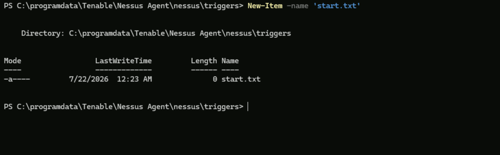

Once the file is created, the Nessus Agent detects it, automatically deletes the file, and begins the vulnerability assessment.

To verify that the endpoint is properly communicating with Tenable, I will navigate to the registered agent within the Tenable console.

Everything appears healthy, confirming that the agent is online and ready to execute the scan.

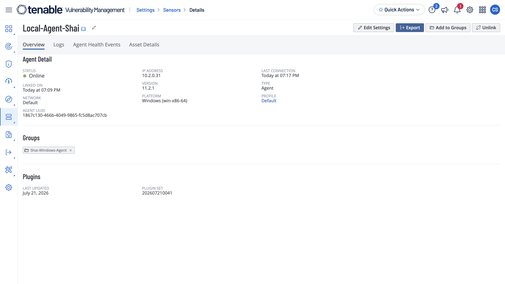

After several minutes, the scan is successfully triggered. One indication that the process has started is that the **`start.txt`** file has been automatically removed from the trigger directory.

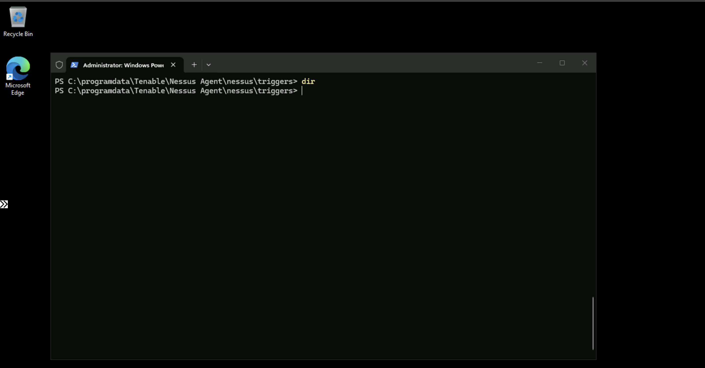

With the scan complete, I can now review the vulnerability assessment results generated by the DISA STIG scan template.

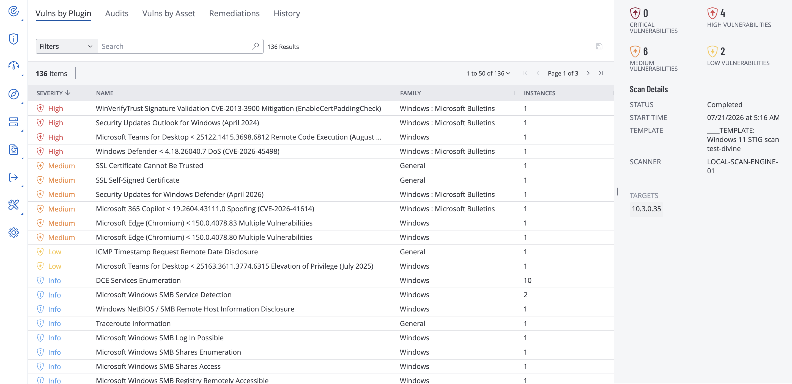

The assessment identified:

- **4 High** severity findings
- **6 Medium** severity findings
- **2 Low** severity findings

---

# Conclusion

This project demonstrated how to perform an authenticated internal vulnerability assessment using Tenable's **DISA Security Technical Implementation Guide (STIG)** scan template against a Windows virtual machine. Unlike traditional vulnerability scans that primarily focus on identifying missing patches and known software vulnerabilities, the DISA STIG template evaluates whether a system is configured according to established Department of Defense security baselines.

By deploying a Nessus Agent, organizing it within an Agent Group, configuring a trigger-based scan, and reviewing the resulting compliance findings, this project illustrated how organizations perform configuration compliance assessments without relying on continuous network-based credentialed scanning. Agent-based assessments provide an efficient method of evaluating endpoints regardless of firewall restrictions or network segmentation while reducing administrative overhead associated with credential management.

The findings produced by the scan represent configuration weaknesses and compliance violations that can be remediated to improve the system's overall security posture. In enterprise environments, assessments such as these play a critical role in maintaining standardized security configurations, supporting regulatory compliance, and reducing the organization's attack surface.
