# Using a DISA STIG Scan Template
# Project Overview

In this project, I will demonstrate how to perform a **DISA Security Technical Implementation Guide (STIG)** compliance assessment against a Windows virtual machine using the **DISA STIG Scan Template** within Tenable.

Unlike a traditional vulnerability scan, which primarily identifies missing patches and known software vulnerabilities, a DISA STIG assessment evaluates whether a system is configured according to the security hardening standards established by the **U.S. Department of Defense (DoD)**. These standards define recommended security settings designed to reduce attack surfaces, enforce secure system configurations, and improve the overall security posture of Windows systems.

Using the DISA STIG Scan Template, I will demonstrate how organizations perform configuration compliance assessments to identify insecure settings, policy violations, and deviations from established security baselines. The resulting findings provide administrators with actionable recommendations for hardening systems and maintaining compliance with industry and government security standards.

---

## What is a DISA STIG Scan Template?

A **DISA Security Technical Implementation Guide (STIG) Scan Template** is a preconfigured compliance assessment that evaluates whether a system is configured in accordance with the security hardening standards developed by the **Defense Information Systems Agency (DISA)**. Unlike a traditional vulnerability scan that focuses primarily on missing patches and known software vulnerabilities, a STIG scan examines system configurations, security policies, user privileges, auditing settings, and other security controls to identify deviations from established security baselines.

Organizations use DISA STIG scans to strengthen system security, standardize configurations across enterprise environments, and verify compliance with government and industry security requirements. The resulting report highlights configuration weaknesses and provides administrators with guidance for remediating findings and improving the overall security posture of their systems.

---

# Virtual Machine Creation & Configuration

To begin this demonstration, I will deploy a **Windows 11** virtual machine within Microsoft Azure. This system will serve as the target for the DISA STIG compliance assessment.

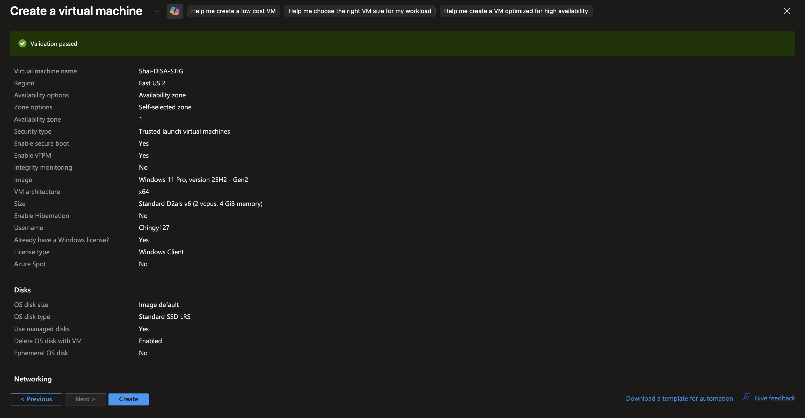

After the virtual machine has been deployed, I will connect to it using **Azure Bastion**. Before performing the assessment, I will temporarily disable **Windows Defender Firewall**.

> **Note:** This configuration is performed strictly for demonstration purposes within an isolated lab environment. In production, the firewall should remain enabled. If a vulnerability scanner requires access, the preferred approach is to create inbound firewall rules that permit traffic only from the authorized scanning system rather than disabling the firewall entirely.
> 

To open the firewall configuration, right-click the **Start** button, select **Run**, type:

```bash
wf.msc
```

and press **Enter**.

Next, I will select **Windows Defender Firewall Properties**.

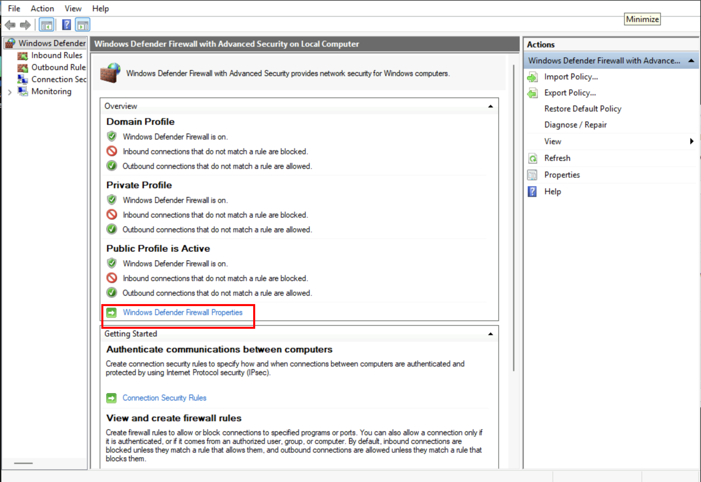

Windows separates firewall settings into three profiles:

- **Domain**
- **Private**
- **Public**

For this demonstration, I will disable all three profiles before applying the changes.

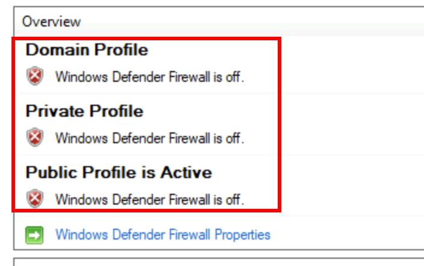

With the firewall configured, I will intentionally introduce several insecure configurations that violate DISA STIG recommendations. These misconfigurations provide known compliance failures that the assessment should detect.

The following changes will be made:

- Create an additional **Administrator** account.
- Configure the account with a blank password.
- Set the password to never expire.
- Add the account to the **Administrators** group.
- Enable the built-in **Guest** account.
- Configure the Guest account with no password.
- Set the Guest password to never expire.
- Add the Guest account to the **Administrators** group.

These settings intentionally weaken the security posture of the system and should be identified during the compliance assessment.

To configure the accounts, I will open **Computer Management**, expand **Local Users and Groups**, and select the **Users** folder.

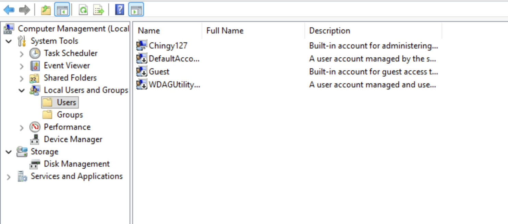

I will create a new user named Administrator, leave the password blank, enable Password Never Expires, and create the account.

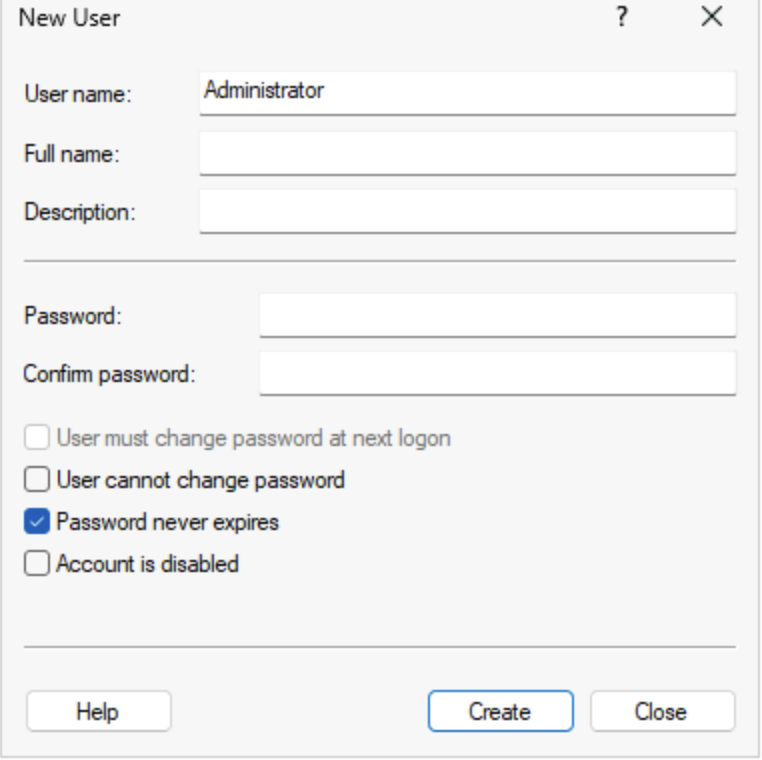

Although the account is named **Administrator**, Windows does **not** automatically grant administrative privileges based on the account name alone. Permissions are determined by **group membership**, not by the account's name.

To grant administrative privileges, I will open the **Administrators** group and add the newly created account.

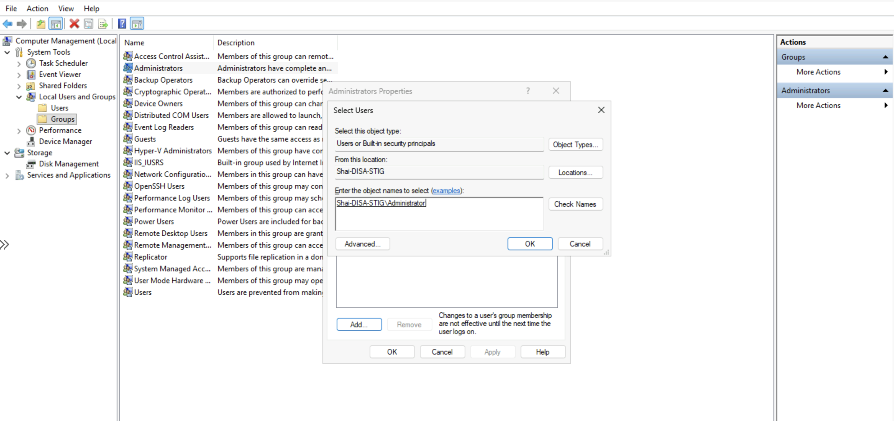

Next, I will modify the built-in **Guest** account.

From the **Users** folder, I will right-click the Guest account and select **Set Password**.

When prompted, I will simply select **OK** without specifying a password, leaving the account configured without one.

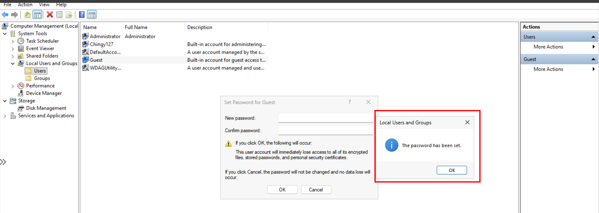

I will then open the Guest account's Properties, enable Password Never Expires, and apply the changes.

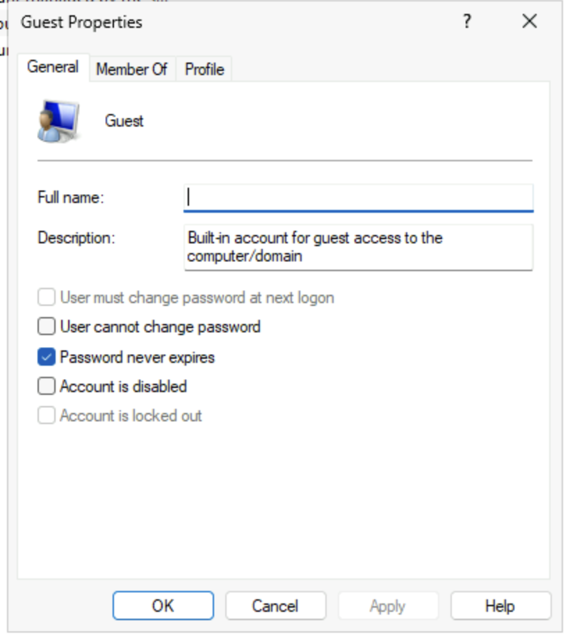

Finally, I will add the Guest account to the Administrators group.

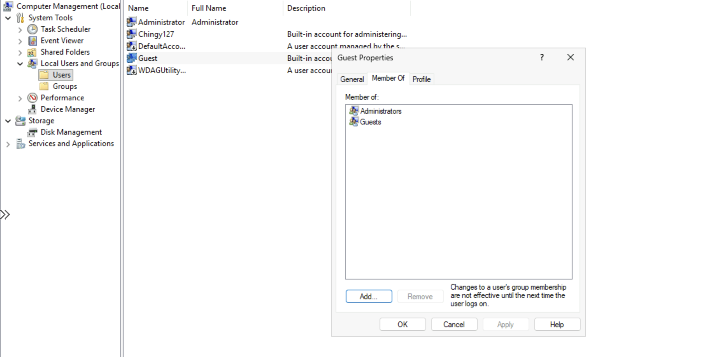

This configuration intentionally violates multiple DISA STIG security recommendations, allowing the compliance assessment to demonstrate its ability to detect insecure account configurations and excessive privilege assignments.

---

# Creating Scan Template

With the Windows virtual machine configured, I can now create a reusable **DISA STIG compliance scan template** within the Tenable platform.

Creating a scan template allows administrators to define all scanning options—including credentials, discovery settings, compliance audits, plugins, and assessment options—only once. Rather than manually configuring every future scan, the template can be reused across multiple systems, ensuring consistency and reducing administrative effort. This approach is especially valuable in enterprise environments where hundreds or thousands of endpoints require identical compliance assessments.

To begin, I will select **Advanced Network Scan**.

I will configure the following settings:

### Basic

- Scan Name
- Start the Remote Registry service during the scan ✓
- Enable Administrative Shares during the scan ✓
- Start the Server service during the scan ✓

### Discovery

- Ping Remote Host ✓
- Use Fast Network Discovery ✓
- TCP Port Scanner ✓

### Assessment

- Perform Thorough Tests ✓
- Only Use Credentials Provided by the User ✗ *(Disabled)*

### Credentials

Provide the credentials for the Administrator account created earlier.

### Compliance

Add the compliance audit:

- **DISA Microsoft Windows 11 STIG v2r7**

### Plugins

Enable:

- General
- Policy Compliance
    - Windows Compliance Checks
- Settings
- Windows
- Windows: Microsoft Bulletins
- Windows: User Management

Once the template has been configured, it is ready for future compliance assessments.

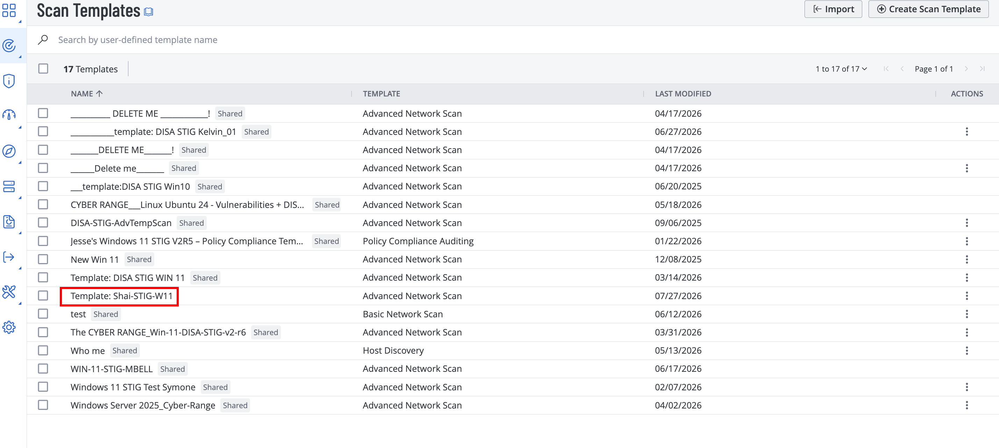

# Creating/Running the Scan

With the template complete, I can now create a vulnerability assessment using the configuration that was just defined.

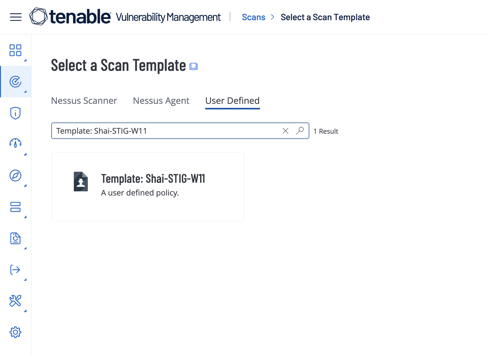

Because the scan template already contains the discovery, credential, compliance, and plugin settings, only a few additional configurations are required.

For this scan, I will specify:

- Scan Name
- Scanner: **Local Scan Engine**
- Scan Type: **Internal**
- Target: Windows Virtual Machine Private IP Address

The private IP address can be obtained from the Azure portal by selecting the virtual machine.

Once these settings have been configured, I will save the scan and launch the assessment.

Approximately **40 minutes** later, the scan completes successfully.

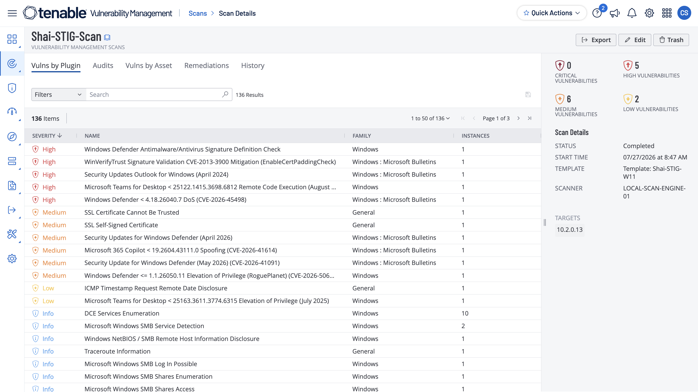

The assessment identified:

- **5 High** severity findings
- **6 Medium** severity findings
- **2 Low** severity findings

To review the compliance results, I will navigate to the **Audits** section.

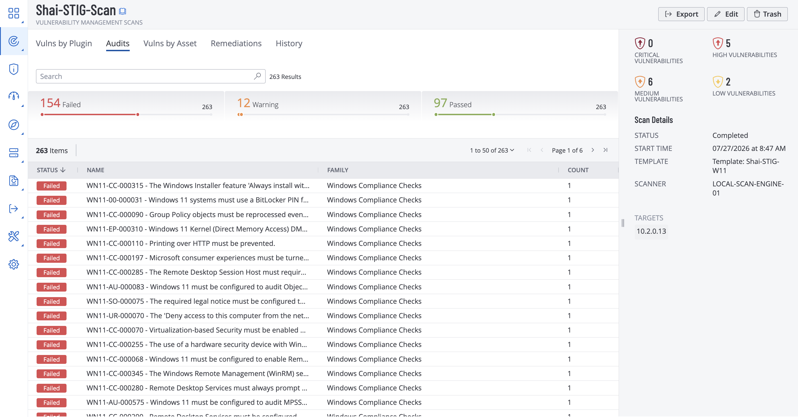

The compliance assessment reports:

- **97 Passed**
- **154 Failed**

Each failed audit represents a configuration that does not comply with the Windows 11 DISA STIG baseline.

To verify that the scan detected the intentionally introduced weaknesses, I will first search for **Guest**.

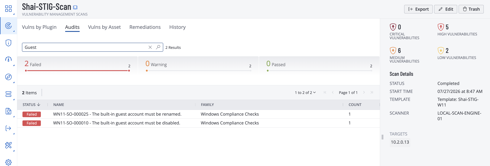

The compliance assessment correctly identifies that the built-in **Guest** account is enabled.

Under DISA STIG guidance, the Guest account should remain **disabled** because it provides an unnecessary attack surface. Even when protected by a password, Guest accounts are frequently targeted during unauthorized access attempts because they are well-known default accounts present on Windows systems. Disabling the account reduces opportunities for attackers to exploit or misuse it.

Next, I will search for the custom **Administrator** account.

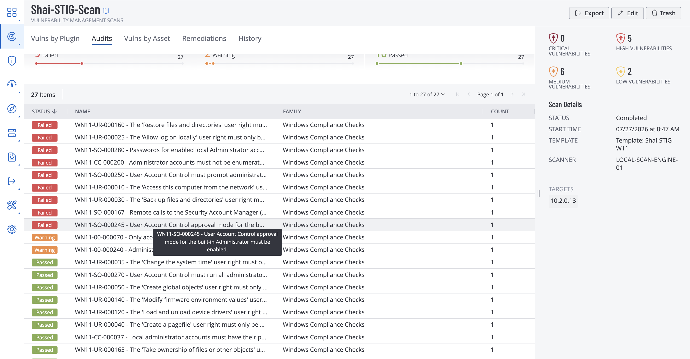

The scan successfully detects the additional Administrator account and reports that **Admin Approval Mode** is not enabled.

**Admin Approval Mode** is a security feature of **User Account Control (UAC)** that requires administrative actions to be explicitly approved before they are executed. Instead of automatically granting elevated privileges to administrative accounts, Windows prompts for confirmation, helping prevent malware and unauthorized applications from silently performing privileged operations.

Because the manually created Administrator account does not enforce this protection, it fails the DISA STIG compliance check and represents a security configuration weakness

---

# Conclusion

This project demonstrated how to perform a **DISA STIG compliance assessment** against a Windows 11 virtual machine using Tenable's Advanced Network Scan template. By intentionally introducing insecure account configurations before the assessment, the scan successfully identified multiple compliance violations, including an enabled Guest account, improper administrative privileges, and missing security controls required by the Windows 11 DISA STIG baseline.

Unlike traditional vulnerability scans that primarily focus on missing patches and known software vulnerabilities, DISA STIG assessments evaluate whether a system has been securely configured according to established security hardening standards. This provides organizations with valuable insight into configuration weaknesses that could increase the attack surface even on fully patched systems.

The results of this assessment demonstrate the importance of configuration compliance as a key component of vulnerability management. By identifying policy violations and providing actionable remediation guidance, DISA STIG scans help organizations standardize secure system configurations, improve their overall security posture, and maintain compliance with government and industry security requirements.
