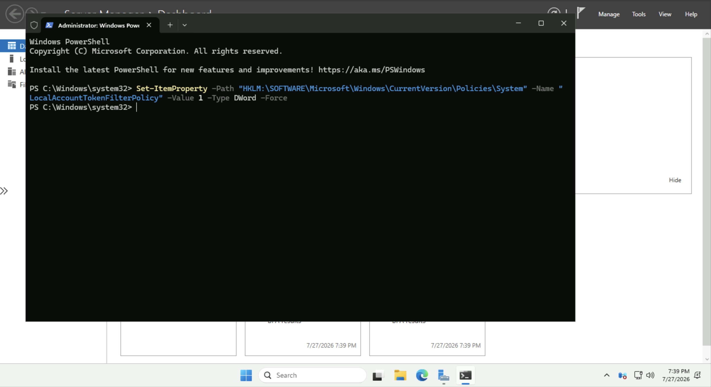
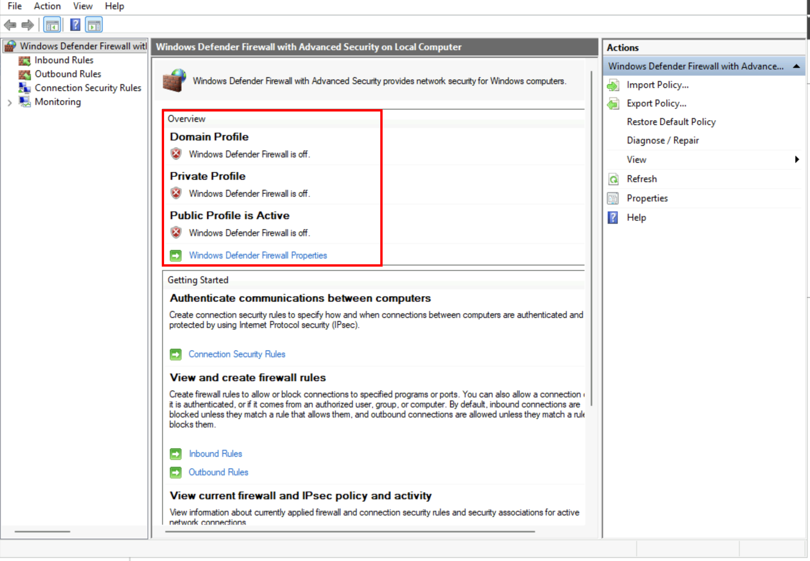
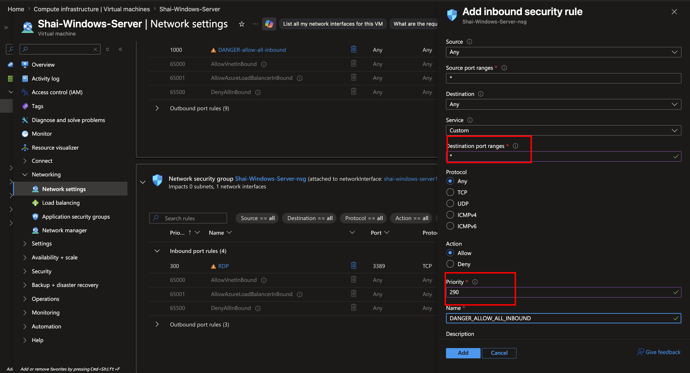
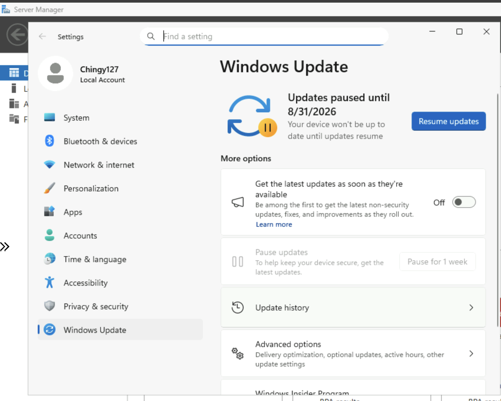
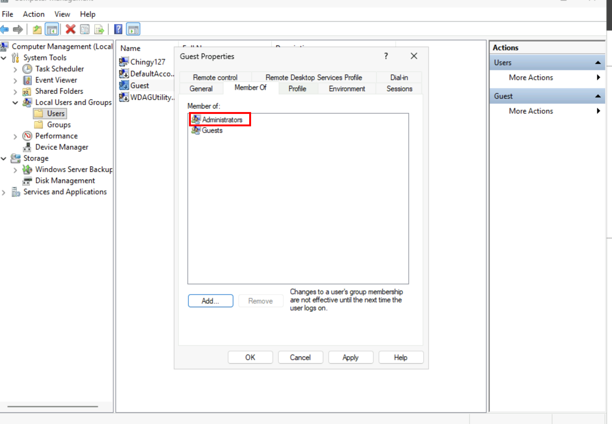
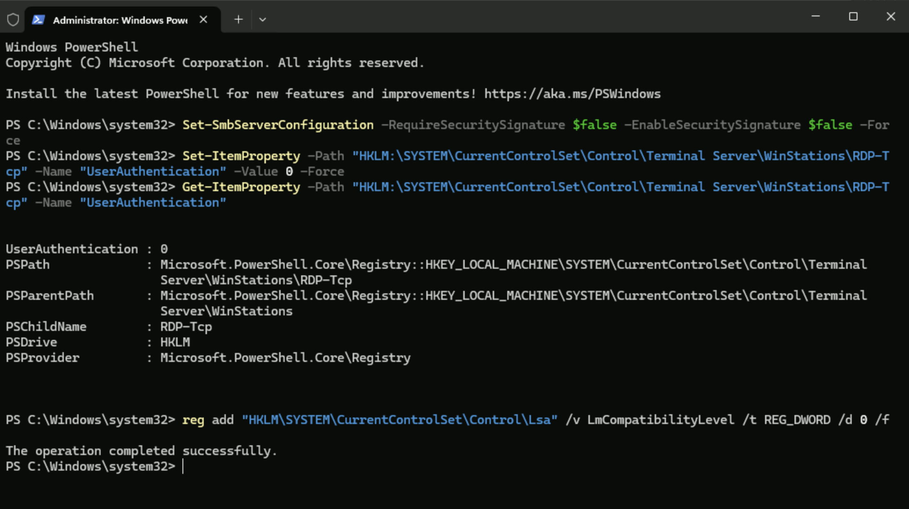
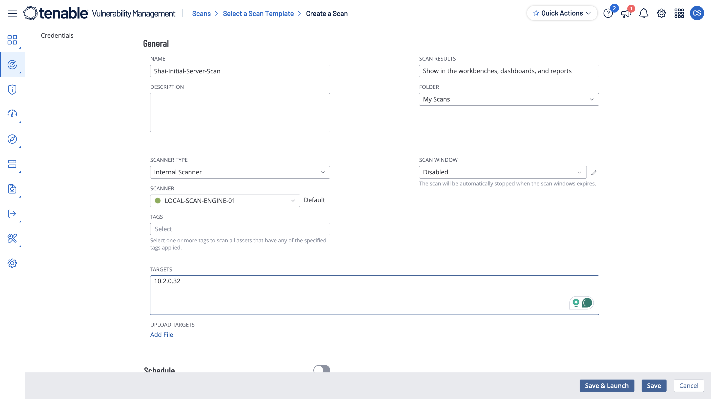
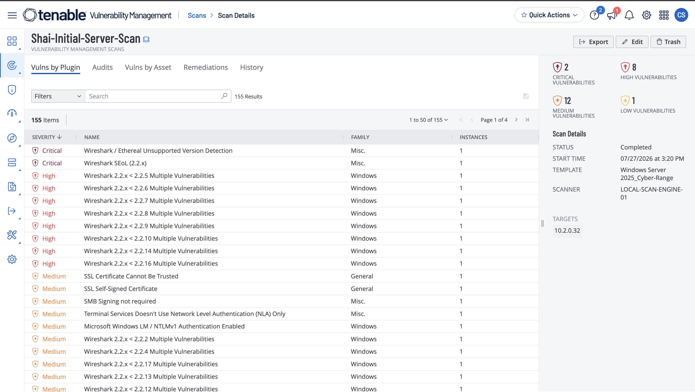
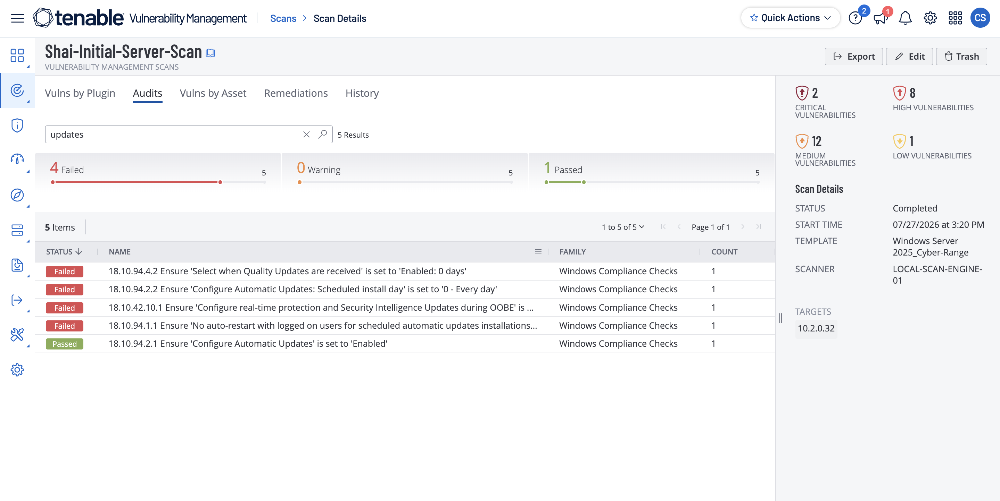

# Initial Scan of Vulnerable Server

# Project Overview

In this project, I will perform an **initial authenticated vulnerability assessment** against a **Windows Server** virtual machine using the Tenable platform. Unlike previous demonstrations that focused on Windows workstations, Linux systems, compliance assessments, or agent-based scanning, this project targets a server operating system commonly deployed to host critical enterprise services and infrastructure.

The purpose of this initial assessment is to establish a **baseline** of the server's security posture before any remediation activities are performed. The scan will identify missing security updates, configuration weaknesses, insecure services, and other vulnerabilities that could expose the system to compromise. The resulting report will serve as the foundation for a multi-stage remediation process.

This project is the **first installment of a seven-part vulnerability management series**. After documenting the initial scan findings, the remaining six projects will focus on remediating specific vulnerabilities identified during the assessment. Following each remediation, the server will be rescanned to verify that the issue has been successfully resolved and to measure how the overall security posture improves over time.

By following the complete lifecycle of **identify → remediate → validate**, this series demonstrates how vulnerability management is performed in real-world enterprise environments, where security is continuously improved through repeated assessment, remediation, and verification rather than a single vulnerability scan.

---

# Virtual Machine Creation & Configuration

For this demonstration, I will deploy a **Windows Server 2025 Datacenter (Generation 2)** virtual machine in Microsoft Azure. Unlike a standard Windows workstation, Windows Server is designed to host enterprise services such as Active Directory, file sharing, web applications, and remote administration, making it a common target for vulnerability management programs.


After the virtual machine has been deployed, I will connect to it using **Azure Bastion**. Once connected, I will launch **Windows PowerShell** with administrative privileges and execute the following command:

```bash
**Set-ItemProperty -Path "HKLM:\SOFTWARE\Microsoft\Windows\CurrentVersion\Policies\System" -Name "LocalAccountTokenFilterPolicy" -Value 1 -Type DWord -Force**
```

This command enables **LocalAccountTokenFilterPolicy**, which allows local administrator accounts to authenticate remotely with full administrative privileges. By default, Windows applies **User Account Control (UAC) remote restrictions**, which filter administrative tokens for local accounts during remote connections. Enabling this policy allows credentialed vulnerability scanners, such as Tenable, to perform a complete authenticated assessment by accessing administrative resources that would otherwise be restricted.

> **Note:** While this configuration is commonly used in lab environments to facilitate authenticated scanning, production environments should rely on properly managed domain accounts and follow the principle of least privilege whenever possible.
> 



Next, I will temporarily disable **Windows Defender Firewall**.



This is performed solely to simplify communication between the vulnerability scanner and the target system within the isolated lab environment.

> **Important:** In production environments, the firewall should remain enabled. Instead of disabling it, administrators should create inbound rules that allow traffic only from authorized vulnerability scanning systems.
> 

Finally, I will configure the Azure **Network Security Group (NSG)** by adding an inbound rule that allows the scanner to communicate with the virtual machine.



> **Note:** Opening inbound access broadly is acceptable only within an isolated lab. In enterprise environments, inbound rules should be restricted to the IP addresses of authorized scan engines.
> 

---

# Creating Intentional Vulnerabilities

To demonstrate the vulnerability management lifecycle, I will intentionally introduce several security weaknesses before performing the initial assessment. These configurations are designed to simulate common issues that may exist within enterprise environments and will serve as the foundation for the remediation projects that follow.

The following vulnerabilities will be introduced:

- Disable Windows Update
- Enable the Guest account and add it to the Administrators group
- Install an outdated version of Wireshark
- Disable SMB Signing
- Disable Remote Desktop Network Level Authentication (NLA)
- Configure the system to use a weak LAN Manager authentication level

Each of these weaknesses should be detected during the authenticated vulnerability assessment and will later be remediated individually throughout this project series.

1. Disable Windows Update

To simulate a server that is no longer receiving security updates, I will pause Windows Updates for five weeks.

This allows the operating system to fall behind on security patches, increasing the likelihood that known vulnerabilities will be identified during the assessment.



1. Add Guest Account to “Administrators”

Next, I will enable the built-in **Guest** account and add it to the **Administrators** group.



This intentionally creates an excessive privilege configuration that violates security best practices. Guest accounts should normally remain disabled because they provide an unnecessary attack surface, and they should never possess administrative privileges.

1. Install OLD outdated Wireshark Insecure Software Windows
2. Disable SMB Signing

```powershell
Set-SmbServerConfiguration -RequireSecuritySignature $false -EnableSecuritySignature $false -Force
```

This command disables **SMB Signing**, a security feature that digitally signs Server Message Block (SMB) traffic to verify that communications have not been modified while in transit.

Without SMB Signing, attackers performing machine-in-the-middle attacks may be able to intercept or manipulate SMB communications between systems. Although disabling SMB Signing can slightly improve performance, it significantly reduces the integrity and authenticity of SMB traffic and is considered an insecure configuration in most enterprise environments.

1. RDP Without Network Level Authentication (NLA) Disabled

```powershell
Set-ItemProperty -Path "HKLM:\SYSTEM\CurrentControlSet\Control\Terminal Server\WinStations\RDP-Tcp" -Name "UserAuthentication" -Value 0 -Force
```

This command disables **Network Level Authentication (NLA)** for Remote Desktop Protocol (RDP).

Normally, NLA requires users to authenticate before a full Remote Desktop session is established, helping reduce exposure to brute-force attacks and denial-of-service attempts. Disabling this protection allows remote connections to begin before authentication occurs, increasing the server's attack surface.

To verify:

```powershell
Get-ItemProperty -Path "HKLM:\SYSTEM\CurrentControlSet\Control\Terminal Server\WinStations\RDP-Tcp" -Name "UserAuthentication"
```

1. Weak LAN Manager Authentication Level

```powershell
reg add "HKLM\SYSTEM\CurrentControlSet\Control\Lsa" /v LmCompatibilityLevel /t REG_DWORD /d 0 /f
```

This command configures Windows to support the weakest LAN Manager authentication level.

Setting **LmCompatibilityLevel** to **0** allows the system to use older LM and NTLM authentication protocols, which are significantly less secure than modern NTLMv2 authentication. These legacy protocols are susceptible to password cracking, relay attacks, and other credential-based attacks, making this a common finding during security assessments.



After running those commands, I will restart the machine via PowerShell:

```powershell
Restart-Computer -Force
```

This command immediately restarts the server.

A restart ensures that all registry modifications, authentication settings, service configurations, and operating system policies are fully loaded before the vulnerability assessment begins.

Once the server is available again, I will reconnect through Azure Bastion and confirm that the system is functioning properly.

---

# Scanning the Server

With the server configured and the intentional vulnerabilities introduced, I will create an **authenticated vulnerability scan** within Tenable.

I will use the custom Windows Server scan template that has already been configured within the live training environment.

An authenticated scan allows Tenable to log in to the target server using valid administrative credentials. This provides deeper visibility than an unauthenticated scan because the scanner can inspect:

- Installed applications and software versions
- Windows registry settings
- Local user and group configurations
- Operating system patches
- Security policies
- Running services
- SMB configurations
- Remote Desktop settings
- Authentication policies
- Other protected system information

After selecting the Windows Server scan template, I will configure the following scan settings:

- **Name:** A descriptive name for the initial baseline scan
- **Scanner Type:** Internal
- **Scanner:** Local scan engine
- **Target:** Windows Server private IP address



- The private IP address can be located within the Azure portal by selecting the Windows Server virtual machine and reviewing its networking information.

After confirming the settings, I will save and launch the scan.

The authenticated scan completed after approximately **24 minutes**.



The scan identified:

- **2 Critical** findings
- **8 High** findings
- **12 Medium** findings
- **1 Low** finding

These results establish the server's initial vulnerability baseline.

The presence of critical and high-severity findings indicates that the server contains weaknesses that could significantly affect confidentiality, integrity, availability, or administrative control if exploited.

When reviewing the scan results, Tenable correctly identified the outdated version of Wireshark installed on the server.

The scanner was able to inspect the installed application version, compare it against known vulnerability information, and determine that the software was outdated and vulnerable.

Next, I navigated to the **Audits** section and searched for findings related to Windows Updates.



The scan successfully identified the update-related configuration that was introduced earlier.

This confirms that the authenticated assessment can inspect system policies and determine whether security updates are being delayed, disabled, or improperly managed.

---

# Conclusion

This project established the initial security baseline for a seven-part Windows Server vulnerability management series. A Windows Server 2025 virtual machine was deployed in Microsoft Azure and intentionally configured with several common security weaknesses, including delayed operating system updates, an overprivileged Guest account, outdated software, disabled SMB Signing, disabled Network Level Authentication, and support for weak legacy authentication protocols.

An authenticated Tenable scan was then performed against the server. Because the scanner had valid administrative access, it was able to examine protected system information such as installed software, registry settings, user privileges, update configurations, authentication policies, and security controls.

The assessment identified **2 critical**, **8 high**, **12 medium**, and **1 low-severity finding**, demonstrating that the intentionally insecure configurations significantly weakened the server's overall security posture. The scan also successfully detected the outdated Wireshark installation and the Windows Update configuration, confirming that the assessment had sufficient visibility into the operating system.

These results will serve as the baseline for the remaining six projects in this series. Each project will focus on remediating one of the introduced security weaknesses and then rescanning the server to verify that the fix was successful.

