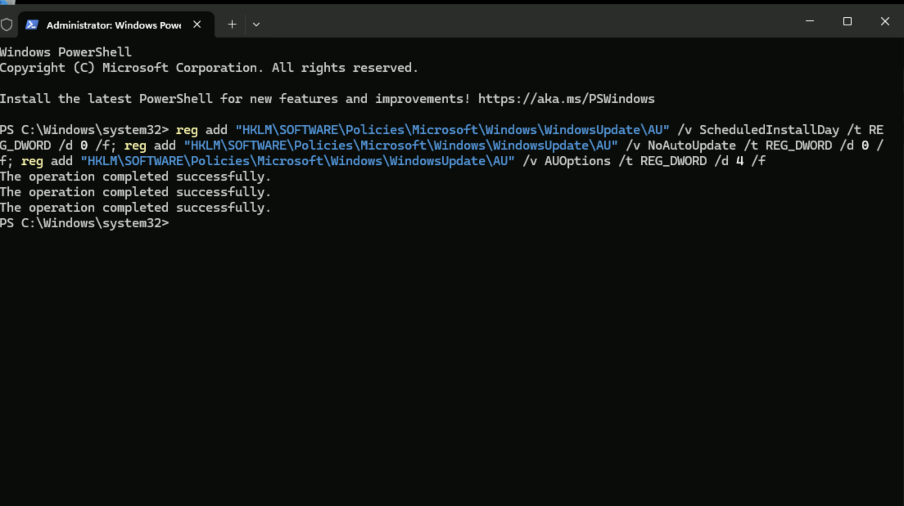
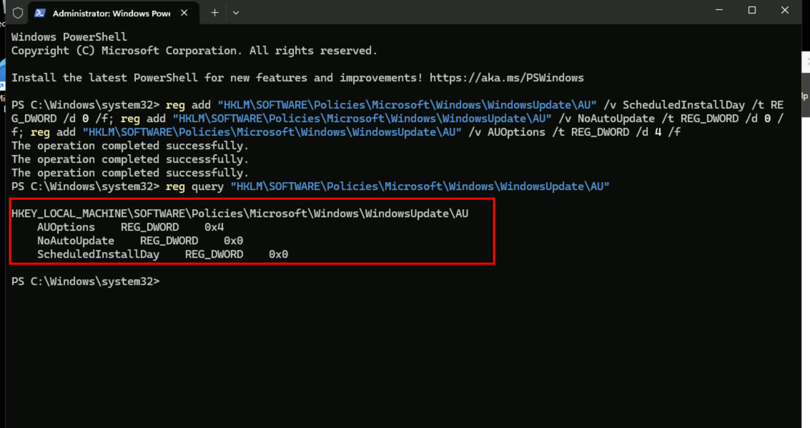
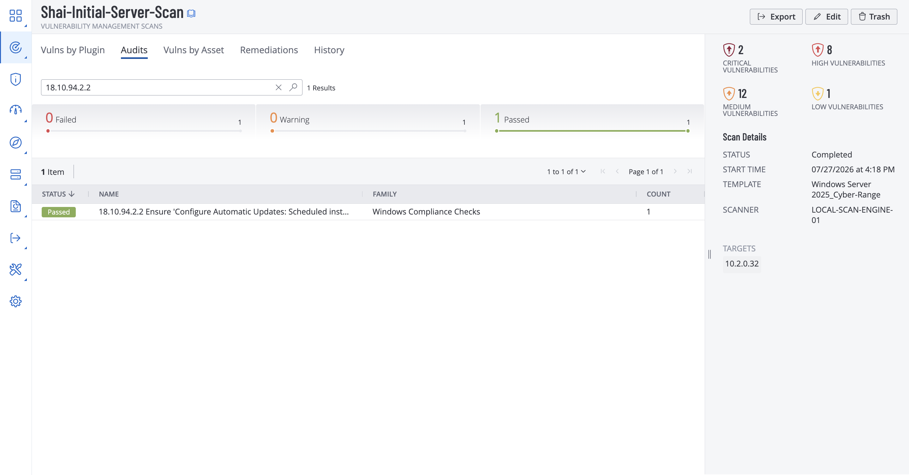

# Remediation #1 — Windows OS Update

## Project Overview

In this project, I will complete the first remediation in the Windows Server vulnerability management series by installing missing operating system and security updates.

The initial Tenable scan identified update-related vulnerabilities caused by the server being out of date. I will install the available updates, restart the server, and run another authenticated scan to confirm that the findings were resolved.

This project demonstrates how vulnerability management teams remediate known issues and validate that the fixes improved the server’s security posture.

---

# Enabling Windows Updates

To begin the remediation, I will log into the Windows Server virtual machine created in the previous project and open **PowerShell** with administrative privileges.

From there, I will run the following command:

```powershell
reg add "HKLM\SOFTWARE\Policies\Microsoft\Windows\WindowsUpdate\AU" /v ScheduledInstallDay /t REG_DWORD /d 0 /f; reg add "HKLM\SOFTWARE\Policies\Microsoft\Windows\WindowsUpdate\AU" /v NoAutoUpdate /t REG_DWORD /d 0 /f; reg add "HKLM\SOFTWARE\Policies\Microsoft\Windows\WindowsUpdate\AU" /v AUOptions /t REG_DWORD /d 4 /f
```

This command updates several Windows Update registry settings to re-enable automatic updates:

- **ScheduledInstallDay = 0** configures Windows to install updates every day.
- **NoAutoUpdate = 0** enables Automatic Updates, allowing Windows to download and install updates automatically.
- **AUOptions = 4** configures Windows to automatically download and schedule the installation of updates.

Together, these settings reverse the configuration from the previous project where Windows Updates were intentionally disabled. Re-enabling automatic updates allows the server to receive the latest security patches and operating system updates, reducing its exposure to known vulnerabilities.



To confirm that the registry changes were successfully applied, I will run the following command:

```powershell
reg query "HKLM\SOFTWARE\Policies\Microsoft\Windows\WindowsUpdate\AU"
```

This command displays the current Windows Update policy settings stored in the registry. Verifying the values ensures that Automatic Updates have been successfully re-enabled before restarting the server.

Expected output:



After confirming the changes, I will restart the server by running:

```powershell
Restart-Computer -Force
```

Restarting ensures that the updated Windows Update policies are fully applied before performing another vulnerability assessment.

---

# Rescanning the Server

Once the server has restarted, I will launch the same authenticated Tenable scan used during the initial assessment.

Using the same scan configuration allows the new results to be directly compared with the original baseline, making it easier to verify whether the remediation successfully resolved the update-related findings.


After launching the scan, I will wait for it to complete.

Once the assessment finishes, I will search for the Windows Update finding to determine whether the vulnerability has been remediated



The vulnerability is now patched and has passed the compliance of the scan

---

# Conclusion

This project completed the first remediation in the Windows Server vulnerability management series by re-enabling Windows Updates and applying the necessary operating system update policies. After restarting the server, an authenticated Tenable scan was performed to verify that the update-related vulnerability had been resolved.

The successful rescan demonstrates the importance of validating remediation efforts rather than assuming a configuration change has fixed the issue. By confirming that the Windows Update finding was no longer detected, the server's security posture was improved and one of the vulnerabilities identified during the initial assessment was successfully eliminated.

This remediation serves as the first step in reducing the server's overall risk. The remaining projects in this series will continue addressing the outstanding vulnerabilities until the server reaches a more secure configuration
