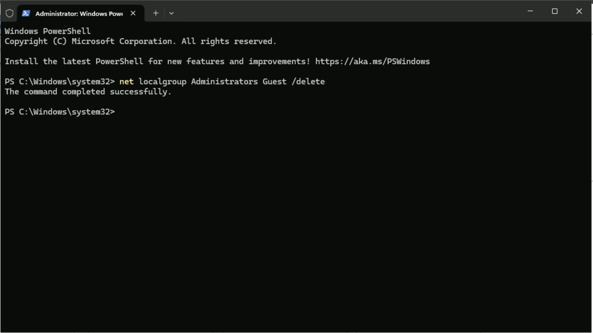
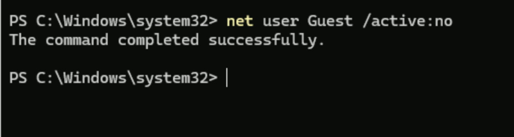
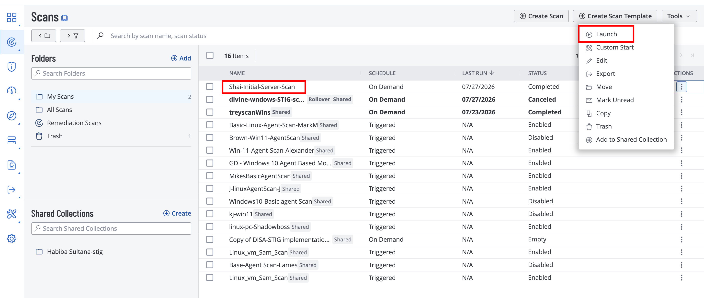
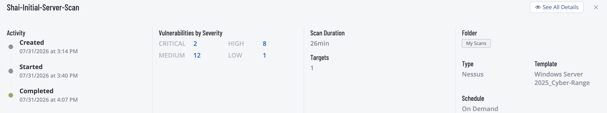
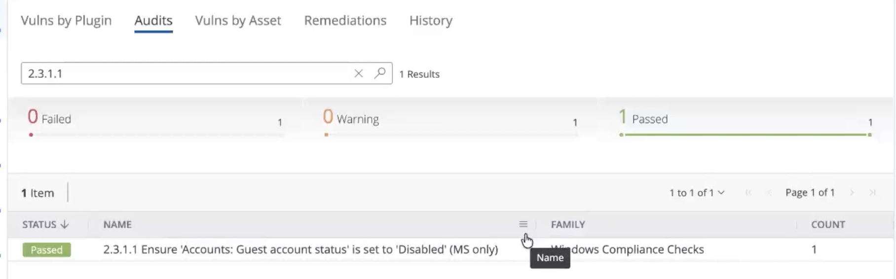

# Remediation #2 — Windows OS Secure Config

# Project Overview

In this project, I will complete the second remediation in the Windows Server vulnerability management series by correcting insecure operating system configurations identified during the initial authenticated vulnerability assessment.

The previous scan detected several configuration weaknesses that increased the server's attack surface and weakened its overall security posture. I will restore these settings to their recommended secure configurations and perform another authenticated Tenable scan to verify that the vulnerabilities have been successfully remediated.

This project demonstrates how secure system configuration is a critical part of vulnerability management and how rescanning validates that remediation efforts were effective.

---

# Removing the Guest Account from the Administrators Group

I will use the same **Windows Server 2025** virtual machine created earlier in this project series.

To begin the remediation, I will open PowerShell with administrative privileges and run the following command:

```powershell
net localgroup Administrators Guest /delete
```

This command removes the built-in **Guest** account from the local **Administrators** group.

The Guest account was intentionally added to this group during the initial configuration, giving it full administrative privileges. This created a serious security risk because anyone able to access the account could potentially modify system settings, install software, manage users, or perform other privileged actions.

Removing the account from the Administrators group restores proper privilege separation and follows the principle of least privilege.



# Disabling the Guest Account

Next, I will run the following command:

```powershell
net user Guest /active:no
```

This command disables the built-in Guest account by setting its active status to **No**.

The Guest account is a predictable default Windows account and is generally unnecessary in modern enterprise environments. Leaving it enabled increases the attack surface because attackers may attempt to use or exploit the account during unauthorized access attempts.

Disabling the account prevents it from being used to sign in while keeping the account available within Windows for compatibility purposes.




After applying the configuration changes, I will restart the server by running:

```powershell
Restart-Computer -Force
```

Restarting ensures that the updated account and security settings are fully applied before the validation scan begins.

---

# Rescanning the Server

Once the server is available again, I will launch the same authenticated Tenable scan used during the previous assessments.

Using the same scan template, credentials, scanner, and target allows the new results to be compared directly with the original baseline.



Now that the scan is finished, let's look at the details



After approximately **26 minutes**, the scan completes, and it identifies

- **2 Critical** findings
- **8 High** findings
- **12 Medium** findings
- **1 Low** finding

Although several vulnerabilities remain on the server, the purpose of this scan is to confirm whether the insecure Guest account configuration was successfully corrected.

I will review the scan findings and search for the vulnerability associated with the Guest account.



The previous finding is no longer detected, confirming that the Guest account was successfully removed from the Administrators group and disabled.

---

# Conclusion

This project completed the second remediation in the Windows Server vulnerability management series by correcting the insecure configuration of the built-in Guest account.

The account was removed from the local Administrators group and then disabled, eliminating the excessive privileges and unnecessary access created during the initial server configuration. After restarting the system, an authenticated Tenable scan confirmed that the targeted finding was successfully remediated.

Although other vulnerabilities remain, this result demonstrates how individual security weaknesses can be corrected and validated through rescanning. The process of applying a targeted fix and confirming its effectiveness is an important part of maintaining a secure and properly configured Windows Server environment.
