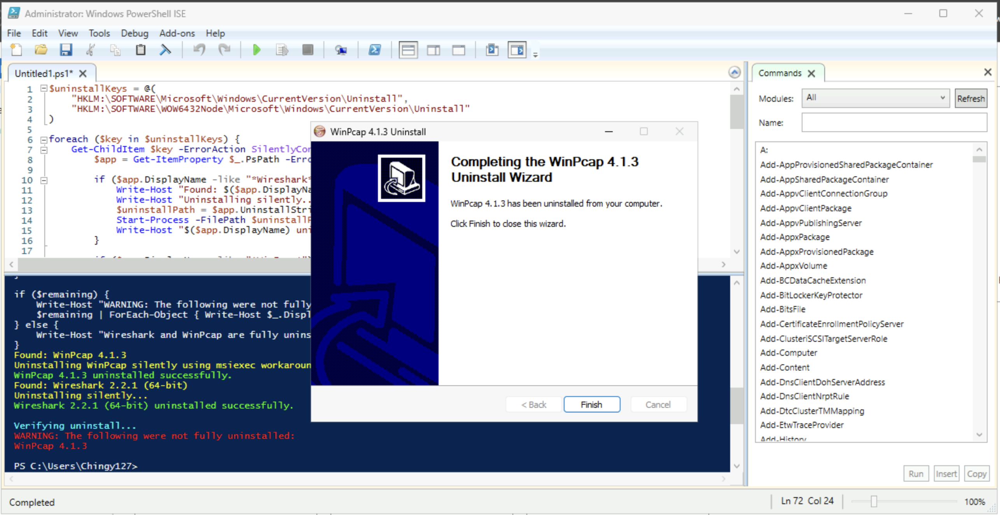
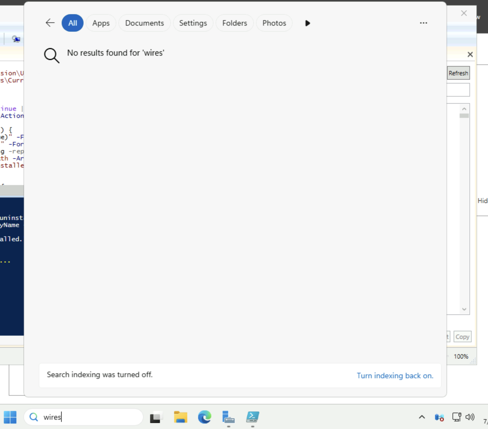
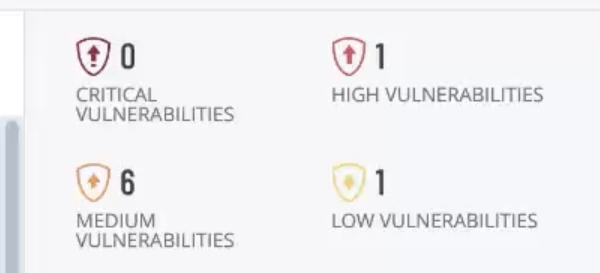
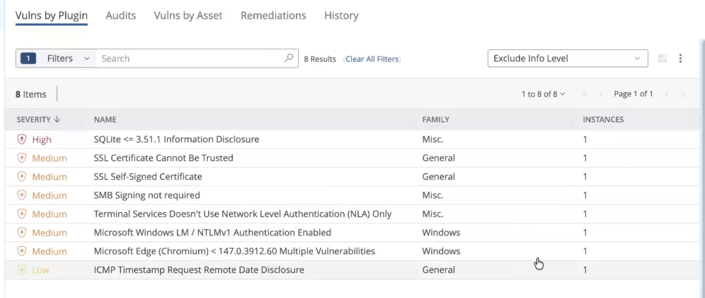
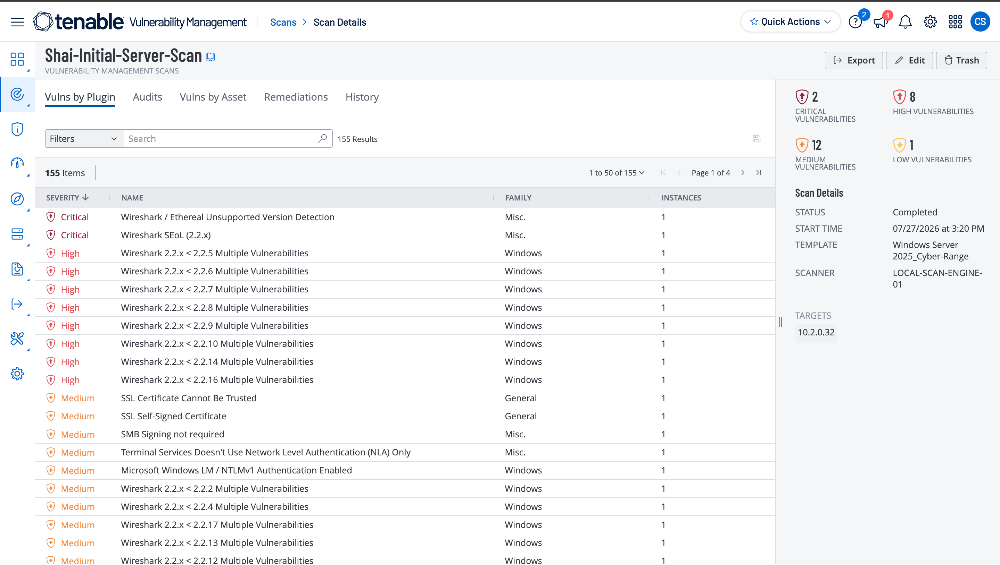

# Remediation #3 — Third Party Software Removal

## Project Overview

In this project, I will complete the third remediation in the Windows Server vulnerability management series by removing outdated third-party software identified during the initial authenticated vulnerability assessment.

The previous scan detected an outdated version of a third-party application that contained known security vulnerabilities. I will uninstall the vulnerable software and perform another authenticated Tenable scan to verify that the finding has been successfully remediated.

This project demonstrates the importance of maintaining third-party software and how removing or updating vulnerable applications helps reduce a system's overall attack surface.

---

# Removing the Vulnerable Software

I will use the same virtual machine hosting **Windows Server 2025** from the previous projects.

During the initial vulnerability assessment, Tenable identified an outdated version of **Wireshark** that contained known security vulnerabilities. Rather than updating the application, I will completely remove it from the server since it is not required for its intended role.

To uninstall the application, I will execute a PowerShell script using **PowerShell ISE**.

PowerShell ISE (Integrated Scripting Environment) provides a graphical interface for creating, editing, and executing PowerShell scripts, making it useful for administrative and automation tasks.



Once the script completes, the Wireshark uninstall wizard finishes the removal process.

After selecting **Finish**, the application has been successfully removed from the system.

To verify the removal, I will search for **Wireshark** on the server.

Since the application no longer appears, the uninstall was successful.



# Restarting the Server

Before validating the remediation, I will restart the server by running the following command:

```
Restart-Computer -Force
```

Restarting ensures that any remaining application processes are terminated and that the operating system fully recognizes the software removal before the vulnerability scan is performed.

# Rescanning the Server

Once the server is available again, I will launch the same authenticated Tenable scan used throughout this project series.

Using the same scan configuration allows the results to be directly compared with the original baseline and previous remediation scans.


After approximately **27 minutes**, the scan completes.



The updated assessment reports:

- **0 Critical** findings
- **1 High** finding
- **1 Medium** finding
- **1 Low** finding

The removal of the outdated Wireshark installation eliminated the critical vulnerabilities that were previously associated with the application.

To further verify the results, I filtered out all informational findings and reviewed only the remaining vulnerabilities.



For comparison, below are the results from the initial authenticated scan performed before any remediation activities.



Comparing the two assessments demonstrates a significant improvement in the server's overall security posture.

---

# Conclusion

This project completed the third remediation in the Windows Server vulnerability management series by removing an outdated version of Wireshark that contained known security vulnerabilities.

After uninstalling the software, restarting the server, and performing another authenticated Tenable scan, the results confirmed that the related findings had been successfully remediated. The updated assessment showed that all critical vulnerabilities had been eliminated, significantly improving the server's overall security posture.

This remediation highlights the importance of managing third-party software as part of a vulnerability management program. Keeping applications up to date—or removing software that is no longer required—reduces the attack surface and helps protect systems from vulnerabilities that could otherwise be exploited by attackers.


