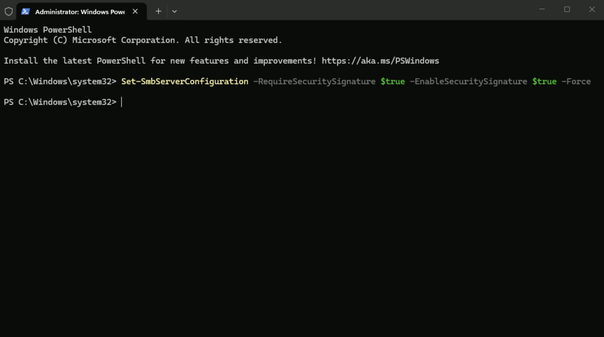
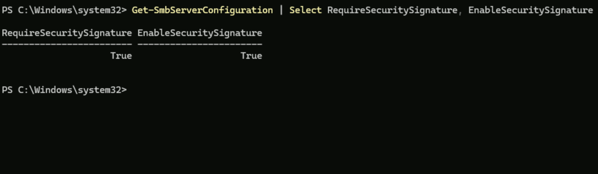
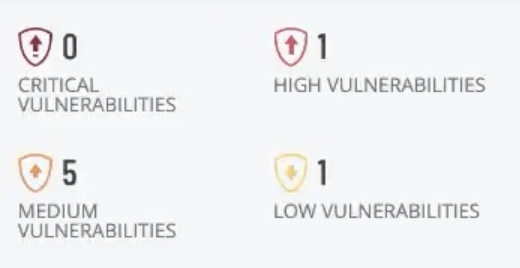
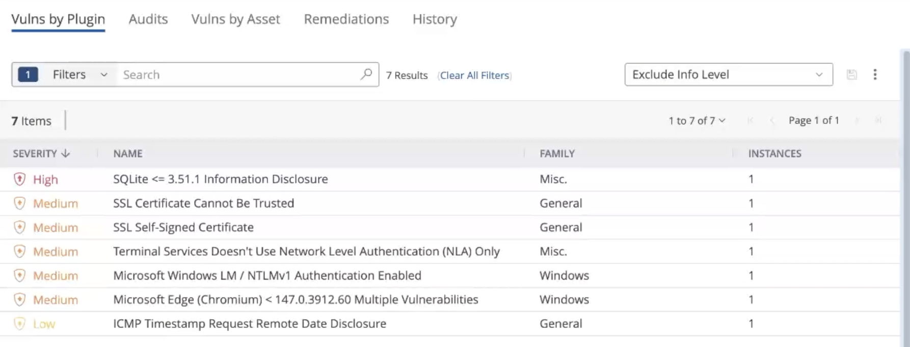

# Remediation #4 — Re-enable SMB Signing

# Project Overview

In this project, I will complete the fourth remediation in the Windows Server vulnerability management series by re-enabling **SMB Signing** on the Windows Server.

The initial vulnerability assessment identified that SMB Signing had been disabled, leaving SMB communications vulnerable to certain network-based attacks. I will restore this security feature to its recommended configuration and perform another authenticated Tenable scan to verify that the vulnerability has been successfully remediated.

This project demonstrates the importance of securing network communications and how restoring built-in security features helps strengthen a server's overall security posture.

---

# Re-enabling SMB Signing

To remediate the SMB Signing vulnerability, I will run the following PowerShell command:

```powershell
Set-SmbServerConfiguration -RequireSecuritySignature $true -EnableSecuritySignature $true -Force
```

This command re-enables **SMB Signing** by configuring the server to both **require** and **support** digitally signed SMB communications.

- **RequireSecuritySignature = $true** forces SMB clients to use signed communications when connecting to the server.
- **EnableSecuritySignature = $true** enables the SMB signing feature on the server.
- **Force** applies the configuration without prompting for confirmation.

SMB Signing helps protect the integrity and authenticity of SMB traffic by digitally signing communications between systems. This reduces the risk of attacks such as **man-in-the-middle (MITM)** and **SMB relay attacks**, where an attacker attempts to intercept or modify network traffic.



To confirm that SMB Signing has been successfully re-enabled, I will run the following command:

```powershell
Get-SmbServerConfiguration | Select RequireSecuritySignature, EnableSecuritySignature
```

This command displays the current SMB Signing configuration for the server.

If both values return **True**, the server has been successfully configured to require and support digitally signed SMB communications.



After verifying the configuration, I will restart the server by running:

```
Restart-Computer -Force
```

Restarting ensures that all configuration changes are fully applied before validating the remediation with another authenticated vulnerability scan.

---

# Rescanning the Server

Once the server has restarted, I will launch the same authenticated Tenable scan used throughout this project series.


After approximately **30 minutes**, the scan completes.



To verify the remediation, I will filter out the informational findings and review the remaining vulnerabilities.



The SMB Signing vulnerability is no longer present, confirming that the remediation was successful.

---

# Conclusion

This project completed the fourth remediation in the Windows Server vulnerability management series by restoring **SMB Signing** to its recommended configuration.

After re-enabling SMB Signing, verifying the configuration, restarting the server, and performing another authenticated Tenable scan, the assessment confirmed that the vulnerability had been successfully remediated. This demonstrates the importance of validating security changes through rescanning rather than assuming a configuration change has resolved the issue.

Requiring digitally signed SMB communications strengthens the integrity of network traffic and helps protect Windows systems against attacks that target insecure SMB sessions. As part of an overall vulnerability management strategy, implementing secure default configurations like SMB Signing plays an important role in reducing a server's attack surface and improving its overall security posture.

