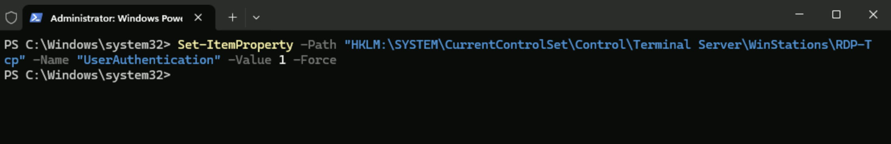
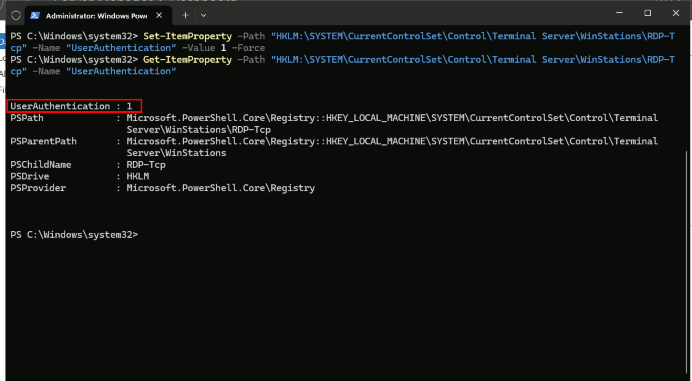
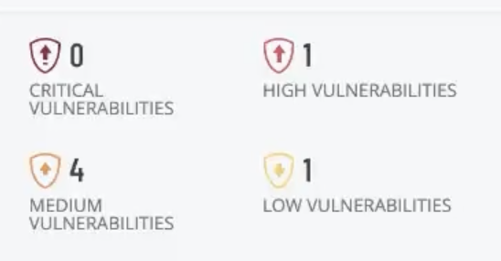
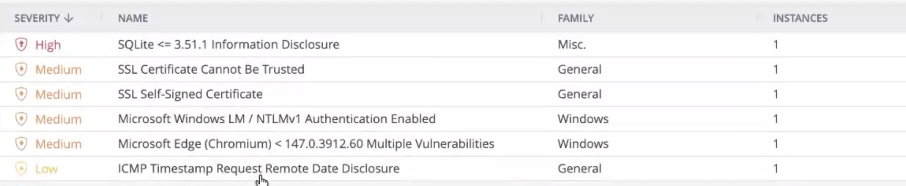

# Remediation #5 — Re-enable RDP NLA

# Project Overview

In this project, I will complete the fifth remediation in the Windows Server vulnerability management series by re-enabling **Remote Desktop Network Level Authentication (NLA)** on the Windows Server.

The initial vulnerability assessment identified that Network Level Authentication had been disabled, increasing the server's exposure to unauthorized remote access attempts. I will restore this security feature to its recommended configuration and perform another authenticated Tenable scan to verify that the vulnerability has been successfully remediated.

This project demonstrates the importance of securing Remote Desktop services and how enabling built-in authentication controls helps reduce the server's attack surface and improve its overall security posture.

---

# Re-enabling Remote Desktop Network Level Authentication

I will be using the same **Windows Server 2025** virtual machine created earlier in this project series.

To re-enable **Remote Desktop Network Level Authentication (NLA)**, I will run the following PowerShell command:

```powershell
Set-ItemProperty -Path "HKLM:\SYSTEM\CurrentControlSet\Control\Terminal Server\WinStations\RDP-Tcp" -Name "UserAuthentication" -Value 1 -Force
```

This command modifies the **UserAuthentication** registry value associated with the Remote Desktop Protocol (RDP) service.

Setting the value to **1** re-enables **Network Level Authentication**, which requires users to successfully authenticate before a full Remote Desktop session is established. This helps reduce the server's exposure to brute-force attacks, unauthorized connection attempts, and certain denial-of-service attacks by ensuring authentication occurs before allocating resources for the remote session.



To confirm that Network Level Authentication has been successfully enabled, I will run the following command:

```powershell
Get-ItemProperty -Path "HKLM:\SYSTEM\CurrentControlSet\Control\Terminal Server\WinStations\RDP-Tcp" -Name "UserAuthentication"
```

This command displays the current value of the **UserAuthentication** registry setting.

A returned value of **1** confirms that Network Level Authentication has been successfully restored.



After verifying the configuration, I will restart the server by running:

```powershell
Restart-Computer -Force
```

Restarting ensures that the updated Remote Desktop configuration is fully applied before validating the remediation with another authenticated vulnerability scan.

# Rescanning the Server

Once the server has restarted, I will launch the same authenticated Tenable scan used throughout this project series.


After approximately **32 minutes**, the scan completes successfully.



To verify the remediation, I will filter out the informational findings and review the remaining vulnerabilities.



The **Remote Desktop Network Level Authentication** finding is no longer present, confirming that the remediation was successful.

---

# Conclusion

This project completed the fifth remediation in the Windows Server vulnerability management series by restoring **Remote Desktop Network Level Authentication (NLA)** to its recommended configuration.

After re-enabling NLA, verifying the registry setting, restarting the server, and performing another authenticated Tenable scan, the assessment confirmed that the vulnerability had been successfully remediated. Requiring authentication before establishing a Remote Desktop session reduces the server's exposure to unauthorized access attempts and strengthens the overall security of remote administration.

This remediation demonstrates how restoring built-in Windows security features can significantly improve a system's security posture. By validating the change through rescanning, the remediation process confirms that the vulnerability has been eliminated and that the server is one step closer to a secure baseline.
