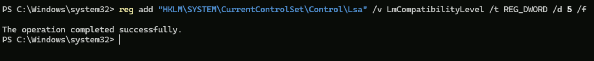
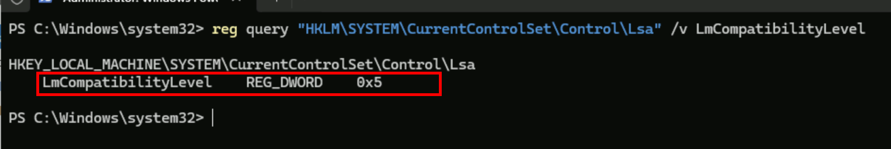
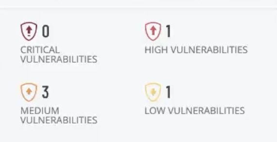
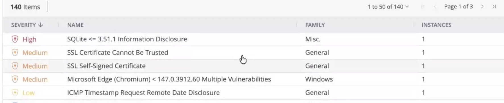

# Remediation #6 — Restore LAN Manager Auth

# Project Overview

In this project, I will complete the final remediation in the Windows Server vulnerability management series by restoring the **LAN Manager authentication level** to its recommended secure configuration.

The initial vulnerability assessment identified that the server had been configured to support weak legacy LAN Manager authentication protocols, increasing the risk of credential-based attacks. I will restore the recommended authentication settings and perform a final authenticated Tenable scan to verify that the vulnerability has been successfully remediated.

This project concludes the Windows Server vulnerability management series by demonstrating how strengthening authentication policies and validating the changes through rescanning helps establish a more secure server configuration.

---

# Restoring the LAN Manager Authentication Level

I will log in to the same **Windows Server 2025** virtual machine used throughout this project series.

To restore the LAN Manager authentication level to a secure configuration, I will run the following PowerShell command:

```powershell
reg add "HKLM\SYSTEM\CurrentControlSet\Control\Lsa" /v LmCompatibilityLevel /t REG_DWORD /d 5 /f
```

This command updates the **LmCompatibilityLevel** registry value to **5**, which configures Windows to use **NTLMv2 authentication only** while refusing older **LAN Manager (LM)** and **NTLM** authentication requests.

Legacy authentication protocols use weaker hashing algorithms and are more susceptible to password cracking, pass-the-hash attacks, and credential relay attacks. By requiring NTLMv2, the server enforces a stronger authentication standard and significantly improves the security of user credential validation.



To verify that the registry value was successfully updated, I will run the following command:

```powershell
reg query "HKLM\SYSTEM\CurrentControlSet\Control\Lsa" /v LmCompatibilityLevel
```

This command displays the current **LmCompatibilityLevel** value stored in the Windows registry.

A returned value of **5** confirms that the server is configured to require NTLMv2 authentication and reject weaker legacy authentication protocols.



After verifying the configuration, I will restart the server by running:

```powershell
Restart-Computer -Force
```

Restarting ensures that the updated authentication policy is fully applied before validating the remediation with another authenticated vulnerability scan.

# Rescanning the Server

Once the server has restarted, I will launch the same authenticated Tenable scan used throughout the previous remediation projects.


After approximately 25 minutes, the scan completes successfully.



To verify the remediation, I will filter out the informational findings and review the remaining vulnerabilities.



The **LAN Manager Authentication Level** vulnerability is no longer present, confirming that the remediation was successful.

---

# Conclusion

This project completed the final remediation in the Windows Server vulnerability management series by restoring the **LAN Manager authentication level** to its recommended secure configuration.

After updating the authentication policy, verifying the registry setting, restarting the server, and performing a final authenticated Tenable scan, the assessment confirmed that the legacy authentication vulnerability had been successfully remediated. By requiring **NTLMv2** authentication and disabling older LM and NTLM protocols, the server is better protected against credential-based attacks and follows modern Windows security best practices.

This final remediation concludes the vulnerability management lifecycle demonstrated throughout this series. Beginning with an intentionally vulnerable Windows Server, each identified finding was systematically remediated and validated through authenticated rescanning. This process reflects how vulnerability management is performed in enterprise environments, where vulnerabilities are continuously identified, prioritized, remediated, and verified to improve an organization's overall security posture.
