# Authenticated vs Unauthenticated Scan: Linux

# Project Overview

In the previous project, I demonstrated the differences between authenticated and unauthenticated vulnerability scans against a Windows virtual machine. In this project, I will perform the same comparison using an intentionally vulnerable **Ubuntu Server** virtual machine to highlight how scan results differ in a Linux environment.

Using the same Microsoft Azure training environment, I will configure and execute both scan types against the same target system. By comparing the results side by side, we can observe how providing valid Linux credentials allows the vulnerability scanner to perform a much deeper assessment than an unauthenticated scan.

---

# VM Configuration

To begin this comparison, I will create an **Ubuntu Server** virtual machine in **Microsoft Azure**. This machine will serve as the target for both the authenticated and unauthenticated vulnerability scans, ensuring that each scan evaluates the exact same environment under identical conditions.

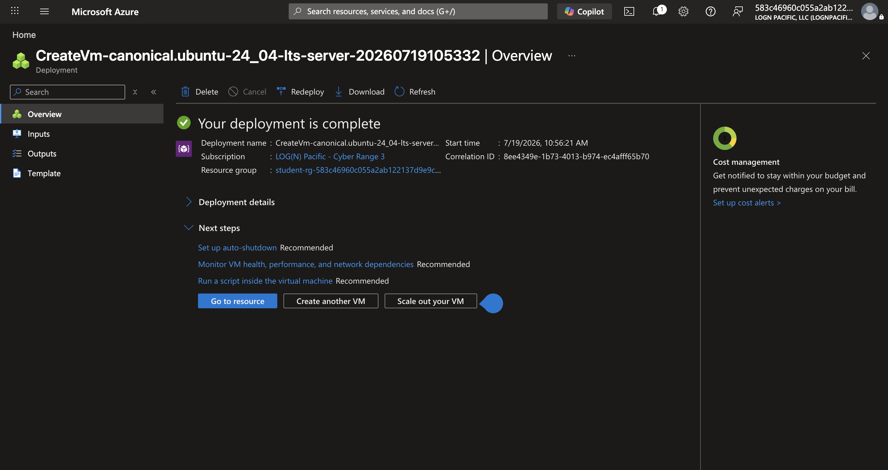

After the virtual machine has been deployed, I will connect to it using **Azure Bastion** and the credentials configured during the deployment process.

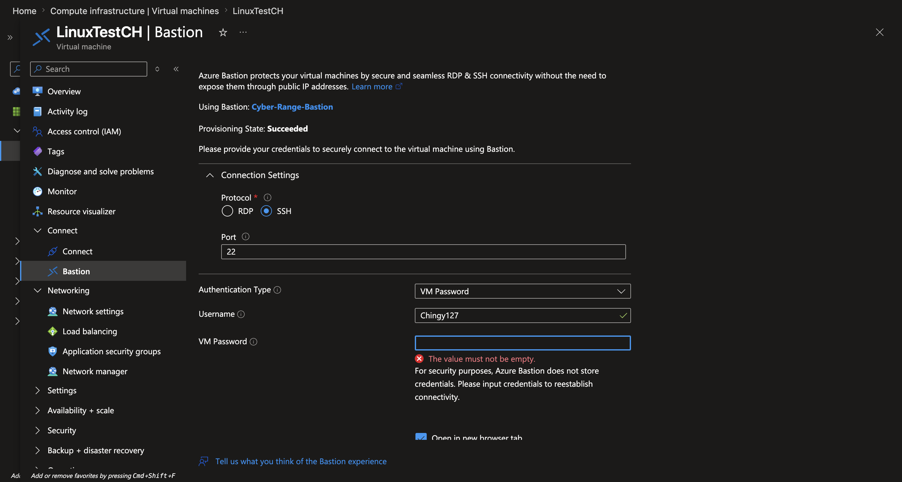

The login is successful, confirming that the virtual machine is operational and ready for testing.

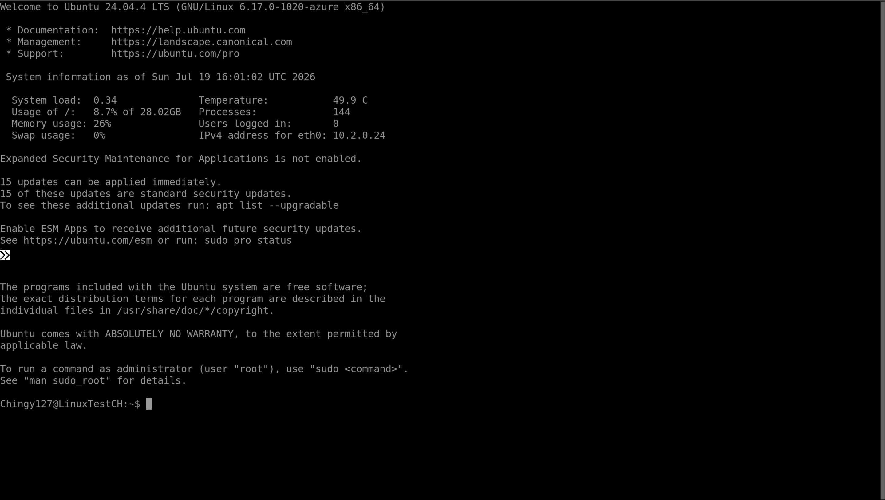

Unlike the Windows demonstration, very little configuration is required before the initial scan. The selected Ubuntu Server image is intentionally an older version that contains numerous known vulnerabilities, making it an ideal target for demonstrating how vulnerability scanners identify outdated software and insecure configurations.

# Scan Creation

## Unauthenticated Scan

I will begin by creating a new **Basic Network Scan** within the Tenable platform and configuring the following settings under the **Basic** tab:

- **Scanner Type:** Internal Scan
- **Scanner:** Local Engine
- **Target:** Linux Virtual Machine Private IP Address

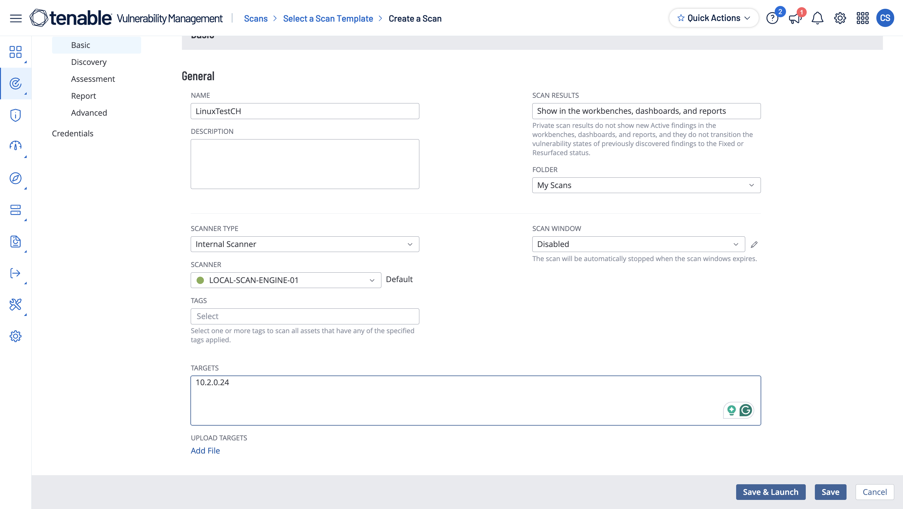

Next, under the **Discovery** tab, I will configure the following options:

- **Scan Type:** Custom
- Enable **Ping Remote Host**
- Enable **Use Fast Network Discovery**

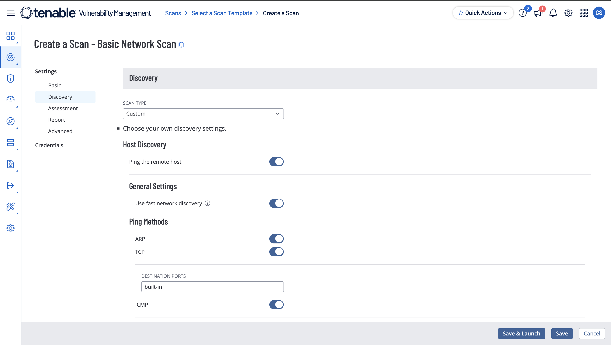

These settings are sufficient for an unauthenticated assessment because the scanner will only evaluate services and information that are publicly accessible over the network. No credentials will be supplied during this scan.

With the configuration complete, I will select **Save & Launch** to begin the scan.

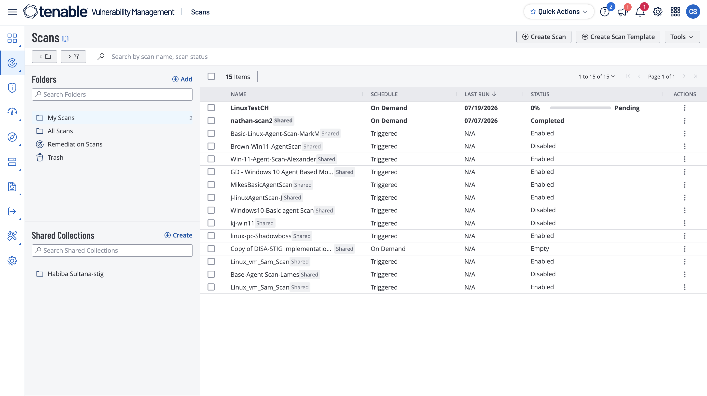

After several minutes, the scan completes successfully.

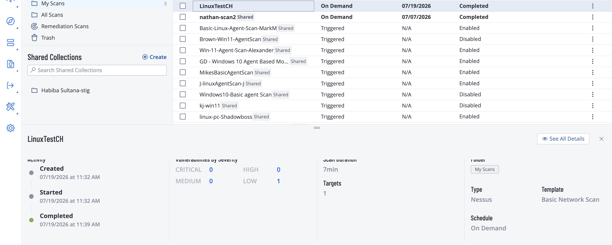

The scan required approximately **7 minutes** to finish.

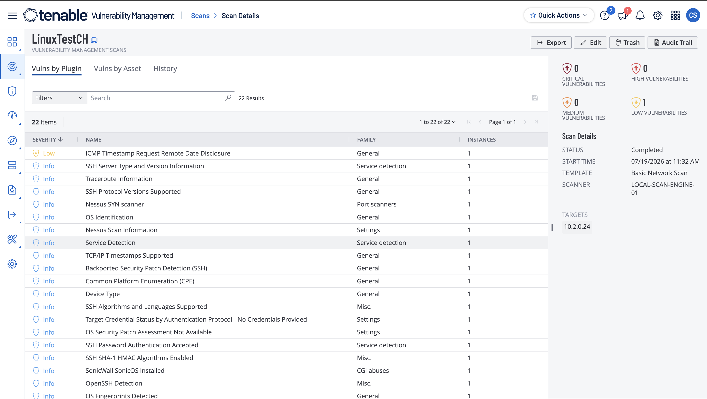

As expected, the unauthenticated scan identified very few vulnerabilities. Because the scanner could not authenticate to the operating system, it was limited to examining only externally visible services and configurations.

Compared to the Windows demonstration, the Linux scan returned even fewer findings. Without valid credentials, Tenable is unable to inspect installed packages, local security settings, configuration files, or missing operating system updates, greatly reducing the effectiveness of the assessment.

---

## Authenticated Scan

To perform an authenticated scan, the scanner must first be able to log into the Linux system using valid credentials. Before configuring Tenable, I will prepare the virtual machine by enabling root authentication.

First, I will execute the following command:

```bash
sudo passwd root
```

This command assigns a password to the **root** account, which is the highest-privileged administrative user on Linux systems. For this lab, the password is temporarily set to **root** to simplify the authentication process.

Next, I will execute the following command:

```jsx
 sudo grep -q '^PermitRootLogin' /etc/ssh/sshd_config && sudo sed -i 's/^PermitRootLogin.*/PermitRootLogin yes/' /etc/ssh/sshd
_config || echo 'PermitRootLogin yes' | sudo tee -a /etc/ssh/sshd_config > /dev/null && sudo systemctl restart ssh
```

Although this command appears complex, its purpose is straightforward. It enables **SSH root login** within the Linux configuration file and restarts the SSH service so the changes take effect.

This allows Tenable to authenticate as the root user and perform a comprehensive assessment of the operating system rather than being limited to externally visible information.

> **Note:** Allowing root login over SSH is generally considered an insecure practice and should not be enabled in production environments. It is used here strictly for demonstration purposes within an isolated lab environment.
> 

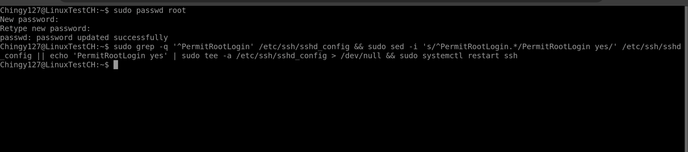

With the virtual machine configured, I can now provide the Linux credentials to Tenable.

Authentication settings:

- **Authentication Method:** Password

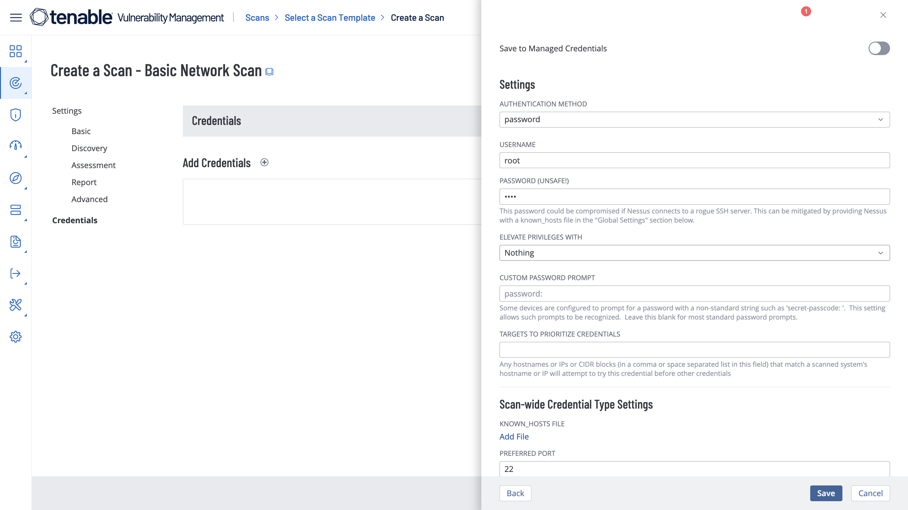

Now, to save the information and run the Authenticated scan 

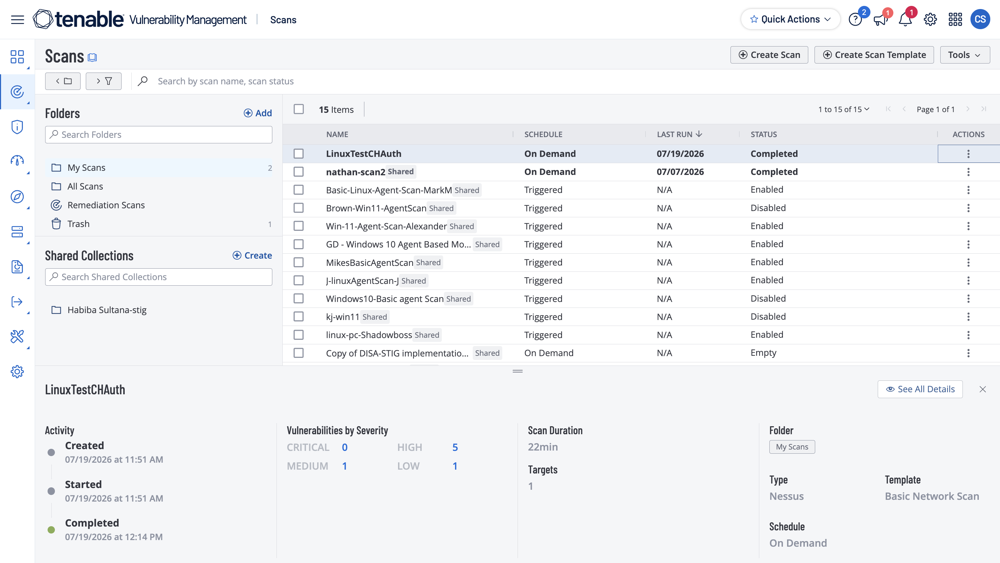

The authenticated scan completed successfully after approximately **22 minutes**.

The scan identified:

- **5 High** severity vulnerabilities
- **1 Medium** severity vulnerability
- **1 Low** severity vulnerability

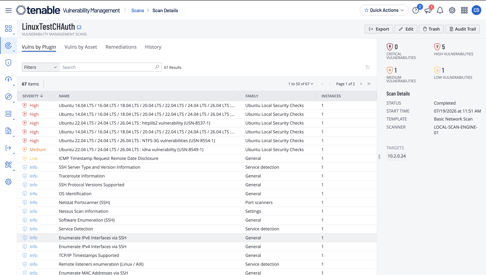

Unlike the unauthenticated assessment, the authenticated scan was able to inspect the operating system from the inside. By logging into the machine with administrative privileges, Tenable could analyze installed software packages, security configurations, file permissions, operating system settings, and missing security updates that would otherwise remain invisible to an external scan.

The increase in both scan duration and the number of identified vulnerabilities demonstrates why authenticated scanning is considered the industry standard for internal vulnerability assessments.

---

# Conclusion

This project demonstrated how authenticated and unauthenticated vulnerability scans differ when assessing a Linux system. While the unauthenticated scan provided only a limited view of externally accessible services, the authenticated scan leveraged administrative credentials to perform a far more comprehensive evaluation of the operating system. As a result, it identified significantly more vulnerabilities, including several high-severity findings that were completely missed during the unauthenticated assessment. This comparison reinforces the importance of credentialed scanning as a best practice for accurately identifying security risks and maintaining a strong vulnerability management program.
