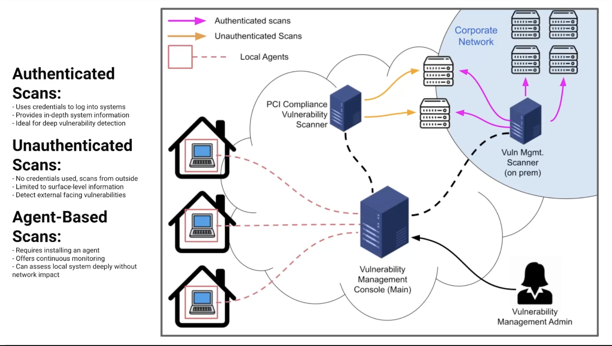
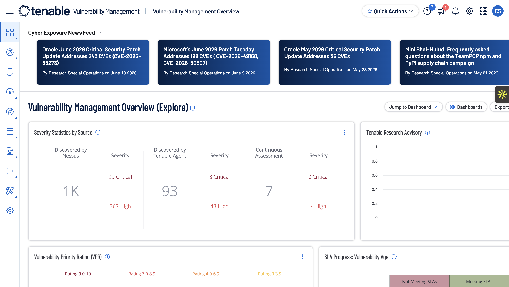

# Vulnerability Scanning with Tenable

# Project Overview

This project introduces the fundamentals of vulnerability assessment using the Tenable platform within a live Microsoft Azure environment. Unlike isolated home labs, this environment is continuously used by thousands of participants who deploy and manage intentionally vulnerable virtual machines for cybersecurity training. Because the environment is active and constantly changing, it closely mirrors the dynamic nature of enterprise cloud infrastructures, where new systems and vulnerabilities are introduced regularly.

Throughout this project series, all demonstrations will be performed within this shared Azure environment to provide realistic examples of vulnerability management workflows and security operations.

---

# What is Tenable (Nessus)?

Tenable Nessus is one of the most widely used vulnerability assessment tools in the cybersecurity industry. Rather than attacking or exploiting systems, Nessus safely inspects computers, servers, virtual machines, and network devices to identify known security weaknesses.

    

During a scan, Nessus compares the target system against an extensive vulnerability database containing thousands of known security issues. It checks for outdated software, missing security patches, insecure configurations, weak encryption, unnecessary services, default credentials, and many other common security risks. Once the scan is complete, Nessus generates a report that categorizes vulnerabilities by severity and provides remediation recommendations to help security teams reduce risk.

Think of Nessus like a mechanic performing a full inspection on a vehicle. Instead of fixing the problems itself, it identifies everything that needs attention and tells you exactly what should be repaired before those issues become more serious.

---

# Types of Vulnerability Scans

    

## Authenticated Scan

Authenticated scans use valid system credentials to log into the target machine during the assessment. This provides the scanner with visibility into operating system configurations, installed software, missing security updates, registry settings, file permissions, and other internal security controls that cannot be observed externally. Because of this deep level of access, authenticated scans typically produce the most comprehensive and accurate vulnerability results and are commonly used for internal vulnerability management programs.

**Example:**

You are scanning a Windows Server using administrator credentials. Since Nessus can log into the machine, it can determine that Microsoft Office is several versions behind, Windows is missing multiple security updates, unnecessary services are enabled, and certain registry settings do not follow security best practices. None of these issues would be visible without authentication.

A simple way to think about it is that an authenticated scan is like giving a building inspector the keys to every room in a house. Since every room can be inspected, the assessment is much more thorough.

---

## Unauthenticated Scan

Unauthenticated scans evaluate a system from the perspective of an external attacker without using login credentials. These scans identify exposed services, open ports, publicly accessible applications, and vulnerabilities that are visible over the network. While they provide less visibility than authenticated scans, they are valuable for assessing an organization's external attack surface and validating what information is exposed to unauthorized users.

**Example:**

Suppose a web server is accessible from the Internet. An unauthenticated scan may discover that ports **`80 (HTTP)`** and **`443 (HTTPS)`** are open, identify the web server software in use, detect that the server is running an outdated version of Apache, and publicly report vulnerabilities associated with that version. However, it cannot determine whether important Windows security patches are missing because it cannot log into the system.

Think of an unauthenticated scan as inspecting a house from the outside. You can observe unlocked doors, broken windows, and other visible issues, but you cannot inspect anything inside the building.

---

## Agent-Based Scan

Agent-based scans rely on lightweight software installed directly on the endpoint rather than performing a traditional network scan. The agent continuously collects vulnerability and configuration data, allowing systems to be assessed even when they are disconnected from the corporate network or protected by firewalls. This approach is especially useful for remote endpoints, laptops, cloud workloads, and devices that are not always reachable over the network.

Unlike traditional scans that require the scanner to connect to the device over the network, the installed agent gathers information locally and securely sends the results back to the Tenable platform whenever the device has Internet connectivity.

**Example:**

Imagine an employee's laptop that is used while traveling and rarely connects to the corporate office network. Since the Tenable agent is already installed, it continues collecting vulnerability information while the employee works remotely. Once the laptop reconnects to the Internet, the collected security data is automatically uploaded to Tenable, allowing security teams to identify missing patches or insecure configurations without requiring the device to be present on the corporate network.

A good way to visualize this is to think of the agent as a health monitor worn by a patient. Instead of requiring the patient to visit the doctor's office every day, the monitor continuously records important information and sends updates whenever it has a connection.

---

# Conclusion

Understanding the differences between authenticated, unauthenticated, and agent-based scanning is important for selecting the appropriate assessment method in different security scenarios. Each approach provides unique visibility into an organization's assets and plays an important role in a comprehensive vulnerability management program.

In the next project, I will demonstrate what an Authenticated vs Unauthenticated scan looks like by using intentionally vulnerable virtual machines that I deploy within this live Azure environment. By comparing the results side by side, I will highlight the strengths, limitations, and practical use cases of each scanning method in a real-world cloud infrastructure.
